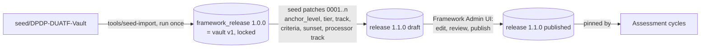
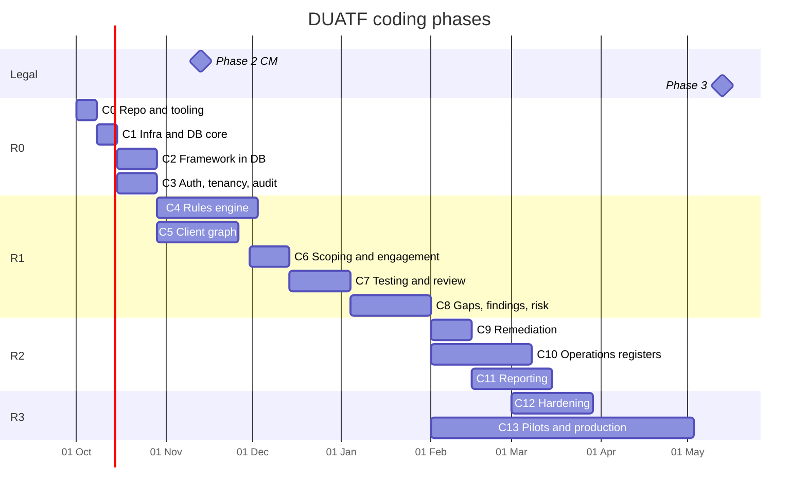

# DUATF GRC Platform: Coding Plan (v1.0, 30 Sep 2026)

This is the build plan for the DUATF GRC web application. It replaces the delivery part (sections 11-13) of `DUATF-GRC-Platform-Plan.md`. The business flow, rules and data model in that document still hold, except where this plan changes them.

**What changed from the first plan**
1. **The database is the source of truth.** The framework content (Act, Rules, obligations, controls, catalogue, overlays, vocabularies, playbooks) lives in PostgreSQL as versioned framework releases.
   - The Obsidian vault is used **once**, as seed input. A one-time importer reads it into the database.
   - After that, the framework is maintained in the app's Framework Admin module.
   - Obsidian import/export is not a requirement, and no feature depends on the vault.
2. **v0.2 framework changes are done in the app,** not by editing notes. These are anchor levels, tiers, tracks, acceptance criteria, sunset dates, the Interpretation Log and the processor track. They are delivered as seed patches (versioned data migrations) plus the admin UI.
3. **The phases are coding phases.** Each sub-phase is a unit of code with named packages, tests (with IDs and expected results) and a review.
4. **Environment:** everything is built and run on the LAN server `omnitrix` (`root@192.168.0.110`, Ubuntu 24.04) under `/root/Source-Code`.
   - Docker services use ports in the 5XXXX range.
   - ClamAV is left out for now. File scanning sits behind an interface with a no-op implementation until it is added.

---

## 1. Environment

| Item | Value |
|---|---|
| Host | `omnitrix` 192.168.0.110, Ubuntu 24.04, 12 cores, 19 GB RAM, ~50 GB free |
| Workspace | `/root/Source-Code` |
| Seed input | `/root/Source-Code/seed/DPDP-DUATF-Vault` (read-only copy, used only by the importer) |
| Docker project | `duatf` (`/root/Source-Code/infra`) |
| Other stacks on the host | ravensoar, surfaceblade. **Never stop or modify them** |
| Runtime | Node 22 LTS (nvm, root user only), pnpm via corepack, Python 3 (engine oracle only) |

| Service | Host port | Status |
|---|---|---|
| PostgreSQL 16 | 55432 | running |
| Redis 7 | 56379 | running |
| MinIO API / console | 59000 / 59001 | running |
| Mailpit SMTP / UI | 51025 / 58025 | running |
| Keycloak 26 | 58080 | pending image (server DNS issue with the IT team) |
| App: web | 53000 | from C1 |
| App: API | 54000 | from C1 |

## 2. Repository layout

```text
/root/Source-Code
  apps/
    web/          Next.js (App Router) - assessor workspace, client portal, admin      :53000
    backend/      Fastify + tRPC API (:54000) and worker entrypoint (BullMQ jobs, clocks, recompute, reports)
    e2e/          Playwright suites
  packages/
    core-types/          zod schemas + TS types (shared FE/BE)
    core-rules-engine/   pure: applicability, derivation, roll-up, risk, dedupe
    core-utils/          IST dates, business clocks, DUATF code generator
    core-trpc/           router contracts + client
    core-ui/             design system
    platform-db/         Drizzle schema, migrations, seed patches, RLS policies, repositories
    platform-auth/       OIDC (Keycloak), sessions, permissions, SoD guard
    platform-jobs/       BullMQ queues, outbox relay, scheduler
    platform-storage/    MinIO client, SHA-256, signed URLs, scanner interface (no-op now)
    platform-reporting/  DOCX / PDF / XLSX
    feature-*/           framework-admin, engagement, scoping, discovery, evidence, applicability,
                         testing, findings, remediation, operations, reporting, admin
  tools/
    seed-import/    one-time vault -> database importer (framework release 1.0.0 = vault v1)
    oracle/         pinned Python v1 engine for differential tests
    traceability/   plan.yaml, collector, gate
  infra/            docker-compose.yml, .env (secrets, mode 600), postgres init
  seed/             DPDP-DUATF-Vault (read-only seed input)
  fixtures/         golden/, scenarios/, demopay/
  plan/             plan.yaml, manual-results/, reviews/
  docs/             this plan, ADRs
```

Rules: dependencies point one way only, `apps → feature-* → platform-* → core-*`; named exports only; strict TypeScript.

## 3. How the framework lives in the database



- **Release 1.0.0** reproduces the vault exactly. The Python engine run on the vault and the TypeScript engine run on the database must agree (golden 46 / 67 / 63 / 54 / 64 / 67).
- **Seed patches** are versioned, idempotent data migrations in `platform-db/seed-patches/`. They carry the v0.2 changes, are reviewed like code and applied by CLI.
- Published releases are **immutable**. Cycles pin a release. Upgrading a cycle shows an impact preview.
- After release 1.1.0, the vault copy is kept only as the parity fixture. All framework maintenance happens in Framework Admin.

## 4. Coding phases

Each sub-phase lists what gets built, its tests (with expected results) and its review. **Test IDs:**
- `TC-C<phase>.<sub>-<nn>`, carried in the automated test's name.

**Where expected values come from:**

| Source | Meaning |
|---|---|
| `literal` | Written in this plan |
| `golden` | A committed fixture file |
| `oracle` | Computed at test time by the Python engine on the same input |
| `sme` | A scenario file signed off by the legal SME |

**Status is computed, never ticked by hand.** `plan/plan.yaml` is the authoritative list of test IDs; the current status is in `plan/STATUS.md`. CI collects test results by ID, matches them against `plan/plan.yaml`, and derives the status of each sub-phase and phase (PASS / FAIL / MISSING / STALE / DRIFT). The full rules are in section 5.

### Release plan

| Release | Coding phases | Target | Outcome |
|---|---|---|---|
| **R0 Foundation** | C0-C3 | 30 Oct 2026 | Repo, CI, database, framework release 1.0.0 in the database, login and tenancy |
| **R1 Assess & Gap (MVP)** | C4-C8 | 1 Feb 2027 | Engine, graph, scoping, testing, findings: an assessment from start to finish |
| **R2 Track & Operate** | C9-C11 | 2 Apr 2027 | Remediation, registers, reports |
| **R3 Hardened 1.0** | C12-C13 | 3 May 2027 | Security, performance, pilots, production on the server |



---

### C0: Repository and tooling (R0)
**Goal:** a working monorepo on the server with CI and the test-tracking harness, so every later phase reports results from its first commit.

| Sub | Build |
|---|---|
| C0.1 | Node 22 via nvm (root user only), pnpm via corepack; git repository in `/root/Source-Code`; `.editorconfig`, `.gitignore` |
| C0.2 | Turborepo + pnpm workspaces; TS strict base config; ESLint with dependency-direction rules; Prettier |
| C0.3 | Vitest workspace, Playwright scaffold, fast-check |
| C0.4 | Traceability harness: `plan/plan.yaml` (generated from this document), test-ID lint, collector (Vitest / Playwright JSON → results), gate script, `TRACEABILITY.md` |
| C0.5 | Local CI: `pnpm verify` runs lint → typecheck → test → build → trace, plus a git pre-push hook. A hosted CI runner can come later. |

| Test | Expected | Source |
|---|---|---|
| TC-C0.2-01 | A fixture import from `core-*` into `feature-*` fails lint | literal |
| TC-C0.4-01 | Plan test with no result → MISSING; result with an unknown ID → UNTRACED; one failure → the sub-phase is FAIL and the gate exits non-zero | literal |
| TC-C0.4-02 | DRIFT, DEFERRED, PLANNED and MANUAL-PENDING are reported without blocking the gate | literal |
| TC-C0.5-01 | `pnpm verify` on a clean clone exits 0 | literal |

**Review:** tech lead reviews the repo structure and lint rules.

### C1: Infrastructure and database core (R0)
**Goal:** the app talks to the Docker services, with migrations, row-level security and the outbox in place.

| Sub | Build |
|---|---|
| C1.1 | `infra/docker-compose.yml` final (postgres, redis, minio, mailpit, keycloak; no ClamAV); `.env` loader with zod validation |
| C1.2 | `platform-db`: Drizzle config, migration runner, UUID + DUATF code generator (ORG-, ACT-, PUR- ...), `tenant_id` + RLS policy template, revision/history columns |
| C1.3 | Outbox table + relay to BullMQ; idempotent consumer base |
| C1.4 | `platform-storage`: MinIO client, SHA-256 on upload, signed URLs, `FileScanner` interface with a `NoopScanner` (ClamAV added later) |
| C1.5 | `apps/backend` health endpoint (`/health` checks DB, Redis, MinIO); `apps/web` shell on :53000 |

| Test | Expected | Source |
|---|---|---|
| TC-C1.1-01 | Missing or invalid env var → the app refuses to start with a named error | literal |
| TC-C1.2-01 | Migrating two empty databases gives an identical schema fingerprint; re-running migrations applies nothing (no down migrations by design, ADR-0001) | literal |
| TC-C1.2-02 | RLS: a tenant-A session selecting tenant-B rows returns 0 rows | literal |
| TC-C1.2-03 | Code generator: the first HR activity of ORG-ACME is `ACT-ACME-HR-001`; parallel inserts give no duplicates | literal |
| TC-C1.3-01 | Event delivered 3 times → one side effect | literal |
| TC-C1.3-02 | The outbox relay publishes each event once and marks it published | literal |
| TC-C1.4-01 | Upload stores the SHA-256; an expired signed URL → 403 | literal |
| TC-C1.5-01 | `/health` → 200, with all three dependencies reported up | literal |
| TC-C1.5-02 | Web and API reachable from another LAN machine | manual |

**Review:** architecture review of the schema conventions and RLS.

### C2: Framework in the database (R0)
**Goal:** all framework content in PostgreSQL as release 1.0.0 (identical to the vault), then v0.2 as seed patches producing release 1.1.0 (draft).

| Sub | Build |
|---|---|
| C2.1 | Framework schema: `framework_release`, `instrument` (section / rule / schedule), `lawful_basis`, `domain`, `obligation`, `acceptance_criterion`, `control`, `obligation_control`, `criterion_control`, `process_template`, `sector_overlay`, `retention_anchor`, `data_element`, `vocabulary`, `vocabulary_term`, `pbc_item`, `question_bank_item`, `stuck_point`, `playbook_doc` (markdown bodies for guides), `interpretation_decision`, `notification_log` |
| C2.2 | `tools/seed-import`: parse the vault (YAML frontmatter + markdown body), validate with zod, map to tables, write release 1.0.0 in one transaction; import report (counts, warnings); dry-run mode |
| C2.3 | Release service: draft → in review → published (immutable, enforced by a DB trigger); diff between releases; pinning |
| C2.4 | Seed patches for v0.2: `in_force_until` (SPDI sunset), `anchor_level`, `tier`, `track` on all obligations; acceptance criteria for core obligations; processor-track obligations; Interpretation Log (6 G4 items). Patches produce release 1.1.0 (draft) for legal review |
| C2.5 | Framework Admin API (read, search, edit a draft, publish with second-person approval) and a basic library UI (browse, search, obligation detail with triggers in plain English) |

| Test | Expected | Source |
|---|---|---|
| TC-C2.2-01 | Release 1.0.0 counts: 44 sections, 23 rules, 8 schedules, 19 bases, 18 domains, 99 obligations (92 OBL + 7 LNK), 82 controls, 124 templates, 20 overlays, 91 data elements, 17 vocabularies, 34 PBC items, 25 stuck points | oracle (counted from the seed at test time) |
| TC-C2.2-02 | Every obligation has ≥ 1 control and every control has ≥ 1 obligation; 0 dangling references | literal |
| TC-C2.2-03 | Profile: actor DF 75, any 9, sdf 7, CM 6, DP 1, state 1; phase 3→86, 0→7, 2→6 | oracle |
| TC-C2.2-04 | Re-running the importer is refused, or with `--dry-run` shows 0 changes | literal |
| TC-C2.2-05 | Every cross-reference stored in note bodies resolves to a framework record | literal |
| TC-C2.2-06 | [drift] Seed counts equal the plan snapshot of 29 Sep 2026 | literal |
| TC-C2.3-01 | UPDATE on a published release's rows fails at DB level | literal |
| TC-C2.4-01 | Release 1.1.0: 100% of obligations have valid `anchor_level`, `tier` and `track` | literal |
| TC-C2.4-02 | Core obligations have 3-6 criteria, each mapped to a control that maps back | literal |
| TC-C2.4-03 | `LNK-SPDI-01` live on 2027-05-12, not live on 2027-05-13 | literal |
| TC-C2.4-04 | Interpretation Log has 6 entries, each with a position and review date | literal |
| TC-C2.5-01 | Publishing by the same user who edited the draft → 403 (SoD); deferred to C3 (needs sign-in) | literal |
| TC-C2.5-02 | Obligation detail returns the controls, law and trigger recorded in the seed | oracle |
| TC-C2.5-03 | Triggers described in plain English | literal |
| TC-C2.5-04 | Search finds law and obligations by citation ("Rule 7", "s.6") and words | oracle |
| TC-C2.5-05 | In-force counts on each commencement date equal the seed | oracle |

**Review:** the legal SME signs off release 1.1.0 content (anchors, tiers, criteria wording) before it is published.

### C3: Authentication, tenancy, audit (R0)
**Goal:** secure multi-tenant access. Keycloak is the target; a development identity provider fallback keeps work unblocked while its image is pending.

| Sub | Build |
|---|---|
| C3.1 | `platform-auth`: OIDC client (Keycloak realm `duatf`, realm export in `infra/keycloak/`); sessions; MFA required by realm policy. **Fallback:** `AUTH_MODE=dev` with seeded local users, disabled in production by config check |
| C3.2 | Tenants, legal entities, memberships (role × scope), permission matrix as data, SoD guard |
| C3.3 | Hash-chained `audit_event`; audit middleware on every mutation |
| C3.4 | Notifications (in-app + email via Mailpit) |
| C3.5 | Web app shell: login, tenant / entity / cycle switcher, navigation per role |

| Test | Expected | Source |
|---|---|---|
| TC-C3.1-01 | `AUTH_MODE=dev` with `NODE_ENV=production` → the app refuses to start | literal |
| TC-C3.2-01 | Generated test per (role, capability) equals the permission matrix, 100% | golden |
| TC-C3.2-02 | Preparer approving own item → 403 + audit entry | literal |
| TC-C3.3-01 | Tampering one audit row makes the chain check fail at that row | literal |
| TC-C3.5-01 | E2E: sign in → switch tenant → sees only that tenant's data | literal |

**Review:** security review (threat model v1).

### C4: Rules engine (R1)
**Goal:** exact v1 parity, then v0.2 per-anchor evaluation, explanations and fast incremental recompute.

| Sub | Build |
|---|---|
| C4.1 | `core-rules-engine` v1 evaluator (pure TS) reading framework rows from the database |
| C4.2 | `tools/oracle` differential harness: Python engine on the seed vault vs TS engine on release 1.0.0; fast-check random contexts |
| C4.3 | v0.2 evaluator: anchors (entity / purpose / cohort / flow / system), tracks, tiers, modes (readiness / compliance / re-assessment), `in_force_until`, s.17 per purpose |
| C4.4 | Reason traces (JSON), N/A reasons, override workflow, run snapshots and run-to-run diff |
| C4.5 | Incremental recompute: dependency index, outbox-driven jobs, performance budget |

| Test | Expected | Source |
|---|---|---|
| TC-C4.1-01 | DemoPay on release 1.0.0: ADM-001 46, CUS-001 67, CUS-002 63, CUS-003 54, HR-001 64, MKT-001 67 | oracle |
| TC-C4.2-01 | 594/594 rows identical (applies + reason) vs Python | oracle |
| TC-C4.2-02 | 10,000 random contexts → 0 differences | oracle |
| TC-C4.3-01..06 | Six stress scenarios (hospital, SaaS processor, 40-entity group, edtech children, startup, bundled consent) match the SME expected files | sme |
| TC-C4.3-07 | as_of 2026-09-30: phase-3 rows labelled readiness; as_of 2027-05-13: compliance | literal |
| TC-C4.4-01 | 100% of N/A rows have a reason; only approved overrides change results, and they are audited | literal |
| TC-C4.5-01 | 800 activities / 2,000 anchors: full recompute < 10 s; single change p95 < 1 s | literal |
| TC-C4.5-02 | 100 runs on the same input → identical output hash | literal |

**Review:** the legal SME signs every scenario diff; performance review.

### C5: Client graph (R1)
**Goal:** map a client's processing as a graph in the app, the collect step.

| Sub | Build |
|---|---|
| C5.1 | Schema and API: department, process (from catalogue), activity, purpose (lawful basis), cohort, data-element use, system, third party (multi-role + rationale), flow, data event, notice, retention rule, consent record type |
| C5.2 | UI: list/detail/edit per object; "instantiate from catalogue" |
| C5.3 | Workshop mode driven by the question bank (from the database) |
| C5.4 | Graph explorer (Cytoscape.js), saved traversals, confidence heatmap, discovery backlog |
| C5.5 | Import: Excel/CSV activity register; DemoPay seed tenant (loaded from the seed vault's example folder by `tools/seed-import --example`) |
| C5.6 | Completeness checks (Stage 2 exit metrics) |

| Test | Expected | Source |
|---|---|---|
| TC-C5.1-01 | A system linked from 30 activities is stored once; a finding on it is visible from all 30 | literal |
| TC-C5.3-01 | Q18 "support outside India" sets `cross_border` and prompts for a flow with a country | literal |
| TC-C5.5-01 | DemoPay tenant: 6 activities, 6 systems, 7 third parties, 13 flows, 6 purposes, 5 tests, 4 findings, 4 remediations | oracle |
| TC-C5.6-01 | DemoPay completeness flags CUS-001 (consent basis with no consent purpose) | golden |

**Review:** assessor UAT with a real department workshop.

### C6: Engagement and scoping (R1)
| Sub | Build |
|---|---|
| C6.1 | Engagement, cycle (mode, as_of, pinned release, scope), RACI |
| C6.2 | Scoping questionnaire (25 Q, from the database) → entity facts rule table; role decision tree → tracks |
| C6.3 | Overlay selection, exemption register |
| C6.4 | PBC generation and client tasks |
| C6.5 | Two-party profile approval, versioning |

| Test | Expected | Source |
|---|---|---|
| TC-C6.2-01 | Q17 → third_schedule; Q9 → CM track; Q7 → processor track | golden |
| TC-C6.2-02 | DemoPay answers → profile equals ORG-DEMO | golden |
| TC-C6.5-01 | Compliance-mode engine run on an unapproved profile is blocked | literal |

### C7: Testing and review (R1)
| Sub | Build |
|---|---|
| C7.1 | Test plan generator (obligation × anchor → controls; P1-P3 mandatory) |
| C7.2 | Test workspace (criteria checklist, test type, sample, evidence, maturity) |
| C7.3 | Evidence portal (PBC upload → review → expiry) |
| C7.4 | Assurance validator (BR-05/06/07) and 4-eyes review |
| C7.5 | Derivation service: criteria → anchor → roll-up → domain → entity index |

| Test | Expected | Source |
|---|---|---|
| TC-C7.4-01 | Inquiry-only test with maturity 3 → rejected | literal |
| TC-C7.5-01 | Truth table: 12/12 cases (plan §6.5) | golden |
| TC-C7.5-02 | One criterion PASS→FAIL propagates to the entity index in < 2 s, with audit | literal |

### C8: Gaps, findings, risk, roadmap (R1 = MVP)
| Sub | Build |
|---|---|
| C8.1 | Gap register (automatic open/close, readiness vs compliance) |
| C8.2 | Finding composer (root-cause key, graph propagation, merge/split) |
| C8.3 | Risk engine (tier floors, context uplifts, bands) |
| C8.4 | Finding lifecycle and client validation |
| C8.5 | Roadmap builder |

| Test | Expected | Source |
|---|---|---|
| TC-C8.2-01 | CTL-NOT-01 failing at PUR-DEMO-001 → one finding covering OBL-NOT-01..04 | golden |
| TC-C8.3-01 | FND-DEMO-001: L5 × I3 = 15, High | golden |
| TC-C8.3-02 | Bands at 4 / 5 / 9 / 10 / 16 / 17 / 25 → Low / Medium / Medium / High / High / Critical / Critical | literal |
| TC-C8.E2E-01 | Playwright: DemoPay from scoping to a report-ready finding list | literal |

### C9: Remediation (R2)
Actions, retest loop, risk acceptance with expiry, reminders and escalation, programme trend.
Tests:
- TC-C9-01: a passing retest closes the finding and recomputes the roll-up.
- TC-C9-02: a Critical finding accepted by a DPO-level user is rejected.
- TC-C9-03: exactly one reminder is sent at target − 7 days.

### C10: Operations registers (R2)
Rights register (statutory 90 days plus internal SLA), breach register (CERT-In 6 h, Board 72 h), DPIA, vendor reviews, authority requests, regulatory change and re-assessment, continuous monitoring, and the commencement job.
Tests:
- TC-C10-01: a request received 2027-06-01 is due by 2027-08-30.
- TC-C10-02: a breach discovered at 2027-06-10 10:00 IST is due to CERT-In by 16:00 the same day.
- TC-C10-03: on 2027-05-13, readiness gaps convert to compliance gaps and SPDI stops being live.

### C11: Reporting (R2)
Dashboards; DOCX/PDF/XLSX reports built from locked snapshots with ComplyX branding; RoPA and Excel exports; audit trail viewer.
Tests:
- TC-C11-01: the same snapshot gives the same content hash.
- TC-C11-02: a report citing an item still marked `verify` is blocked.
- TC-C11-03: every report shows the disclaimer, release, snapshot hash and as_of date.

### C12: Hardening (R3)
Tenant-isolation tests generated for every route, load tests (k6), backup and restore drill (`pg_dump` + MinIO mirror), ClamAV added behind `FileScanner`, accessibility (WCAG 2.2 AA), and a self-assessment of the platform as tenant ORG-XYB.
Tests:
- TC-C12-01: 0 cross-tenant access across all routes.
- TC-C12-02: API p95 under 300 ms with 50 concurrent users.
- TC-C12-03: restore completes in under 4 h and the audit chain verifies.

### C13: Pilots and production on the server (R3)
Production compose profile on `omnitrix` (web :53000, API :54000 behind a reverse proxy on the LAN), systemd/compose restart policies, nightly backups, the three pilots, measurement, and the 1.0 release.
Tests:
- TC-C13-01: coverage across the pilots is 100%.
- TC-C13-02: at most 1.2 findings per root cause.
- TC-C13-03: at least 90% agreement between assessors.
- TC-C13-04: UAT signed off.

---

## 5. Dynamic test matching (unchanged in principle)
`plan/plan.yaml` holds every test ID above, with its expected-value source. The collector reads the Vitest and Playwright JSON reports and the manual result files, matches them by ID, and writes one status per test, sub-phase and phase.
- **Oracle expectations:** computed at run time, for example by running the Python engine on `seed/`.
- **DRIFT:** raised when a computed value differs from the snapshot in this plan; a reviewer must acknowledge it.
- **Gate:** a phase is done only when all its mandatory tests pass and its review record exists. A release also needs every earlier test to still pass.

## 6. Open items
| # | Item | Owner |
|---|---|---|
| O-1 | Server DNS for Docker registries (blocks the Keycloak image) | IT team |
| O-2 | Node 22 via nvm for root | Approve |
| O-3 | Legal SME for C2.4 criteria and C4.3 scenario sign-off | ComplyX |
| O-4 | Pilot client name (Nadall / Mallard) | ComplyX |
