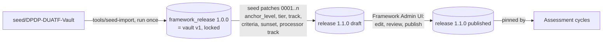
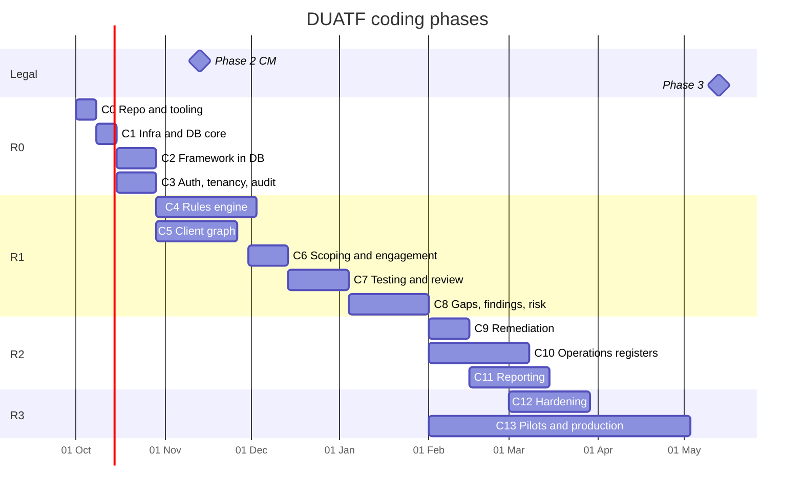

# DUATF GRC Platform: Coding Plan (v1.0, 30 Sep 2026)

This is the build plan for the DUATF GRC web application. It replaces the delivery part (sections 11-13) of `DUATF-GRC-Platform-Plan.md`. The business flow, rules and data model in that document still hold, except where this plan changes them.

**What changed from the first plan**
1. **The database is the source of truth.** The framework content (Act, Rules, obligations, controls, catalogue, overlays, vocabularies, playbooks) lives in PostgreSQL as versioned framework releases.
   - The Obsidian vault is used **once**, as seed input. A one-time importer reads it into the database.
   - After that, the framework is maintained in the app's Framework Admin module.
   - Obsidian import/export is not a requirement, and no feature depends on the vault.
2. **v0.2 framework changes are done in the app,** not by editing notes. These are anchor levels, tiers, tracks, acceptance criteria, sunset dates, the Interpretation Log and the processor track. They are delivered as seed patches (versioned data migrations) plus the admin UI.
3. **The phases are coding phases.** Each sub-phase is a unit of code with named packages, tests (with IDs and expected results) and a review.
4. **Environment:** everything is built and run on the LAN server `omnitrix` (`root@192.168.0.110`, Ubuntu 24.04) under `/root/Source-Code`.
   - Docker services use ports in the 5XXXX range.
   - ClamAV is left out for now. File scanning sits behind an interface with a no-op implementation until it is added.

---

## 1. Environment

| Item | Value |
|---|---|
| Host | `omnitrix` 192.168.0.110, Ubuntu 24.04, 12 cores, 19 GB RAM, ~50 GB free |
| Workspace | `/root/Source-Code` |
| Seed input | `/root/Source-Code/seed/DPDP-DUATF-Vault` (read-only copy, used only by the importer) |
| Docker project | `duatf` (`/root/Source-Code/infra`) |
| Other stacks on the host | ravensoar, surfaceblade. **Never stop or modify them** |
| Runtime | Node 22 LTS (nvm, root user only), pnpm via corepack, Python 3 (engine oracle only) |

| Service | Host port | Status |
|---|---|---|
| PostgreSQL 16 | 55432 | running |
| Redis 7 | 56379 | running |
| MinIO API / console | 59000 / 59001 | running |
| Mailpit SMTP / UI | 51025 / 58025 | running |
| Keycloak 26 | 58080 | pending image (server DNS issue with the IT team) |
| App: web | 53000 | from C1 |
| App: API | 54000 | from C1 |

## 2. Repository layout

```text
/root/Source-Code
  apps/
    web/          Next.js (App Router) - assessor workspace, client portal, admin      :53000
    backend/      Fastify + tRPC API (:54000) and worker entrypoint (BullMQ jobs, clocks, recompute, reports)
    e2e/          Playwright suites
  packages/
    core-types/          zod schemas + TS types (shared FE/BE)
    core-rules-engine/   pure: applicability, derivation, roll-up, risk, dedupe
    core-utils/          IST dates, business clocks, DUATF code generator
    core-trpc/           router contracts + client
    core-ui/             design system
    platform-db/         Drizzle schema, migrations, seed patches, RLS policies, repositories
    platform-auth/       OIDC (Keycloak), sessions, permissions, SoD guard
    platform-jobs/       BullMQ queues, outbox relay, scheduler
    platform-storage/    MinIO client, SHA-256, signed URLs, scanner interface (no-op now)
    platform-reporting/  DOCX / PDF / XLSX
    feature-*/           framework-admin, engagement, scoping, discovery, evidence, applicability,
                         testing, findings, remediation, operations, reporting, admin
  tools/
    seed-import/    one-time vault -> database importer (framework release 1.0.0 = vault v1)
    oracle/         pinned Python v1 engine for differential tests
    traceability/   plan.yaml, collector, gate
  infra/            docker-compose.yml, .env (secrets, mode 600), postgres init
  seed/             DPDP-DUATF-Vault (read-only seed input)
  fixtures/         golden/, scenarios/, demopay/
  plan/             plan.yaml, manual-results/, reviews/
  docs/             this plan, ADRs
```

Rules: dependencies point one way only, `apps → feature-* → platform-* → core-*`; named exports only; strict TypeScript.

## 3. How the framework lives in the database



- **Release 1.0.0** reproduces the vault exactly. The Python engine run on the vault and the TypeScript engine run on the database must agree (golden 46 / 67 / 63 / 54 / 64 / 67).
- **Seed patches** are versioned, idempotent data migrations in `platform-db/seed-patches/`. They carry the v0.2 changes, are reviewed like code and applied by CLI.
- Published releases are **immutable**. Cycles pin a release. Upgrading a cycle shows an impact preview.
- After release 1.1.0, the vault copy is kept only as the parity fixture. All framework maintenance happens in Framework Admin.
- Since C17, the reference sections (lawful bases, data elements, vocabularies, process templates, sector overlays, playbooks) are edited in the app: changes collect in a draft release that a firm administrator reviews and publishes (`/knowledge-base/draft`, ADR-0004).

## 4. Coding phases

Each sub-phase lists what gets built, its tests (with expected results) and its review. **Test IDs:**
- `TC-C<phase>.<sub>-<nn>`, carried in the automated test's name.

**Where expected values come from:**

| Source | Meaning |
|---|---|
| `literal` | Written in this plan |
| `golden` | A committed fixture file |
| `oracle` | Computed at test time by the Python engine on the same input |
| `sme` | A scenario file signed off by the legal SME |

**Status is computed, never ticked by hand.** `plan/plan.yaml` is the authoritative list of test IDs; the current status is in `plan/STATUS.md`. CI collects test results by ID, matches them against `plan/plan.yaml`, and derives the status of each sub-phase and phase (PASS / FAIL / MISSING / STALE / DRIFT). The full rules are in section 5.

### Release plan

| Release | Coding phases | Target | Outcome |
|---|---|---|---|
| **R0 Foundation** | C0-C3 | 30 Oct 2026 | Repo, CI, database, framework release 1.0.0 in the database, login and tenancy |
| **R1 Assess & Gap (MVP)** | C4-C8 | 1 Feb 2027 | Knowledge base, clients, assessments, evidence, findings and risks |
| **R2 Track & Share** | C9-C11 | 2 Apr 2027 | Remediation, dashboards, client portal, reports |
| **R3 Hardened 1.0** | C12-C13 | 3 May 2027 | Security, performance, pilots, production on the server |



---

### C0: Repository and tooling (R0)
**Goal:** a working monorepo on the server with CI and the test-tracking harness, so every later phase reports results from its first commit.

| Sub | Build |
|---|---|
| C0.1 | Node 22 via nvm (root user only), pnpm via corepack; git repository in `/root/Source-Code`; `.editorconfig`, `.gitignore` |
| C0.2 | Turborepo + pnpm workspaces; TS strict base config; ESLint with dependency-direction rules; Prettier |
| C0.3 | Vitest workspace, Playwright scaffold, fast-check |
| C0.4 | Traceability harness: `plan/plan.yaml` (generated from this document), test-ID lint, collector (Vitest / Playwright JSON → results), gate script, `TRACEABILITY.md` |
| C0.5 | Local CI: `pnpm verify` runs lint → typecheck → test → build → trace, plus a git pre-push hook. A hosted CI runner can come later. |

| Test | Expected | Source |
|---|---|---|
| TC-C0.2-01 | A fixture import from `core-*` into `feature-*` fails lint | literal |
| TC-C0.4-01 | Plan test with no result → MISSING; result with an unknown ID → UNTRACED; one failure → the sub-phase is FAIL and the gate exits non-zero | literal |
| TC-C0.4-02 | DRIFT, DEFERRED, PLANNED and MANUAL-PENDING are reported without blocking the gate | literal |
| TC-C0.5-01 | `pnpm verify` on a clean clone exits 0 | literal |

**Review:** tech lead reviews the repo structure and lint rules.

### C1: Infrastructure and database core (R0)
**Goal:** the app talks to the Docker services, with migrations, row-level security and the outbox in place.

| Sub | Build |
|---|---|
| C1.1 | `infra/docker-compose.yml` final (postgres, redis, minio, mailpit, keycloak; no ClamAV); `.env` loader with zod validation |
| C1.2 | `platform-db`: Drizzle config, migration runner, UUID + DUATF code generator (ORG-, ACT-, PUR- ...), `tenant_id` + RLS policy template, revision/history columns |
| C1.3 | Outbox table + relay to BullMQ; idempotent consumer base |
| C1.4 | `platform-storage`: MinIO client, SHA-256 on upload, signed URLs, `FileScanner` interface with a `NoopScanner` (ClamAV added later) |
| C1.5 | `apps/backend` health endpoint (`/health` checks DB, Redis, MinIO); `apps/web` shell on :53000 |

| Test | Expected | Source |
|---|---|---|
| TC-C1.1-01 | Missing or invalid env var → the app refuses to start with a named error | literal |
| TC-C1.2-01 | Migrating two empty databases gives an identical schema fingerprint; re-running migrations applies nothing (no down migrations by design, ADR-0001) | literal |
| TC-C1.2-02 | RLS: a tenant-A session selecting tenant-B rows returns 0 rows | literal |
| TC-C1.2-03 | Code generator: the first HR activity of ORG-ACME is `ACT-ACME-HR-001`; parallel inserts give no duplicates | literal |
| TC-C1.3-01 | Event delivered 3 times → one side effect | literal |
| TC-C1.3-02 | The outbox relay publishes each event once and marks it published | literal |
| TC-C1.4-01 | Upload stores the SHA-256; an expired signed URL → 403 | literal |
| TC-C1.5-01 | `/health` → 200, with all three dependencies reported up | literal |
| TC-C1.5-02 | Web and API reachable from another LAN machine | manual |

**Review:** architecture review of the schema conventions and RLS.

### C2: Framework in the database (R0)
**Goal:** all framework content in PostgreSQL as release 1.0.0 (identical to the vault), then v0.2 as seed patches producing release 1.1.0 (draft).

| Sub | Build |
|---|---|
| C2.1 | Framework schema: `framework_release`, `instrument` (section / rule / schedule), `lawful_basis`, `domain`, `obligation`, `acceptance_criterion`, `control`, `obligation_control`, `criterion_control`, `process_template`, `sector_overlay`, `retention_anchor`, `data_element`, `vocabulary`, `vocabulary_term`, `pbc_item`, `question_bank_item`, `stuck_point`, `playbook_doc` (markdown bodies for guides), `interpretation_decision`, `notification_log` |
| C2.2 | `tools/seed-import`: parse the vault (YAML frontmatter + markdown body), validate with zod, map to tables, write release 1.0.0 in one transaction; import report (counts, warnings); dry-run mode |
| C2.3 | Release service: draft → in review → published (immutable, enforced by a DB trigger); diff between releases; pinning |
| C2.4 | Seed patches for v0.2: `in_force_until` (SPDI sunset), `anchor_level`, `tier`, `track` on all obligations; acceptance criteria for core obligations; processor-track obligations; Interpretation Log (6 G4 items). Patches produce release 1.1.0 (draft) for legal review |
| C2.5 | Framework Admin API (read, search, edit a draft, publish with second-person approval) and a basic library UI (browse, search, obligation detail with triggers in plain English) |

| Test | Expected | Source |
|---|---|---|
| TC-C2.2-01 | Release 1.0.0 counts: 44 sections, 23 rules, 8 schedules, 19 bases, 18 domains, 99 obligations (92 OBL + 7 LNK), 82 controls, 124 templates, 20 overlays, 91 data elements, 17 vocabularies, 34 PBC items, 25 stuck points | oracle (counted from the seed at test time) |
| TC-C2.2-02 | Every obligation has ≥ 1 control and every control has ≥ 1 obligation; 0 dangling references | literal |
| TC-C2.2-03 | Profile: actor DF 75, any 9, sdf 7, CM 6, DP 1, state 1; phase 3→86, 0→7, 2→6 | oracle |
| TC-C2.2-04 | Re-running the importer is refused, or with `--dry-run` shows 0 changes | literal |
| TC-C2.2-05 | Every cross-reference stored in note bodies resolves to a framework record | literal |
| TC-C2.2-06 | [drift] Seed counts equal the plan snapshot of 29 Sep 2026 | literal |
| TC-C2.3-01 | UPDATE on a published release's rows fails at DB level | literal |
| TC-C2.4-01 | Release 1.1.0: 100% of obligations have valid `anchor_level`, `tier` and `track` | literal |
| TC-C2.4-02 | Core obligations have 3-6 criteria, each mapped to a control that maps back | literal |
| TC-C2.4-03 | `LNK-SPDI-01` live on 2027-05-12, not live on 2027-05-13 | literal |
| TC-C2.4-04 | Interpretation Log has 6 entries, each with a position and review date | literal |
| TC-C2.5-01 | Publishing by the same user who edited the draft → 403 (SoD); deferred to C3 (needs sign-in) | literal |
| TC-C2.5-02 | Obligation detail returns the controls, law and trigger recorded in the seed | oracle |
| TC-C2.5-03 | Triggers described in plain English | literal |
| TC-C2.5-04 | Search finds law and obligations by citation ("Rule 7", "s.6") and words | oracle |
| TC-C2.5-05 | In-force counts on each commencement date equal the seed | oracle |

**Review:** the legal SME signs off release 1.1.0 content (anchors, tiers, criteria wording) before it is published.

### V1 product scope (user decision, 30 Sep 2026)

The platform is a **DPDPA Compliance Management Platform** for ComplyX to track clients and share assessment progress with them:

**Client → Departments → Assessment → Questions + Evidence → Findings (gap) → Risk scoring → Recommendations → Remediation → Re-assessment → Reports**

- **Knowledge base:** the framework data (release 1.x) *powers* the app. Questions are built from KB controls; expected evidence, recommendations and regulatory references come from KB obligations and controls. It is presented as one "Knowledge base" page.
- **Central object:** the finding/risk and its evidence trail. Reports are generated from that structured data.
- **Later versions:** V2 (ROPA, data inventory, DIA, rights) and V3 (vendors) follow V1.

### C3: Identity and access (R0)
| Sub | Build |
|---|---|
| C3.1 | Keycloak realm `duatf`: web client (OIDC code + PKCE), admin service client, password policy, brute-force protection, MFA (TOTP) required for new users; idempotent setup script |
| C3.2 | Login and logout (OIDC), server-side sessions (hashed token, httpOnly cookie, 8 h), user profile sync on login |
| C3.3 | Roles and permission matrix: firm_admin, lead_auditor, auditor, client_dpo, department_owner, client_viewer; client and department scoping; RLS per client |
| C3.4 | Hash-chained audit log on every change |
| C3.5 | App shell with role-aware navigation; bootstrap of the first firm admin |

| Test | Expected | Source |
|---|---|---|
| TC-C3.1-01 | Realm setup is idempotent, and the discovery issuer is the LAN URL of realm duatf | literal |
| TC-C3.2-01 | Sessions are stored only as hashes; expired or revoked sessions are refused | literal |
| TC-C3.2-02 | The login callback rejects a mismatched state | literal |
| TC-C3.3-01 | Permission matrix: every role × capability equals the documented table | golden |
| TC-C3.3-02 | An auditor assigned to client A is refused for client B; a department owner is refused outside their department | literal |
| TC-C3.3-03 | A client user can never read another client's rows (RLS) | literal |
| TC-C3.4-01 | Tampering with one audit row breaks chain verification at that row | literal |
| TC-C3.5-01 | Login through Keycloak from a LAN machine lands on the role's home page | manual |

### C4: Knowledge base and question bank (R1)
| Sub | Build |
|---|---|
| C4.1 | One "Knowledge base" page: every section (law, obligations, controls, questions, domains, sectors, processes, data elements, vocabularies, playbooks) with search and a detail pane; the old library URLs redirect |
| C4.2 | Release 1.1.0 = clone of 1.0.0 + DPDPA question bank (one question per control, draft for legal SME review) + SPDI sunset (`in_force_until` 13 May 2027) |
| C4.3 | Evidence suggestions per question: required (control evidence), recommended (obligation evidence), supporting (evidence-request list for the domain) |

| Test | Expected | Source |
|---|---|---|
| TC-C4.1-01 | The knowledge-base service returns every section with items and resolves any item by code | oracle |
| TC-C4.2-01 | Release 1.1.0 carries every 1.0.0 row unchanged (counts per table equal) | oracle |
| TC-C4.2-02 | One question per control; each has ≥ 1 regulatory reference, expected evidence and a recommendation | oracle |
| TC-C4.2-03 | `LNK-SPDI-01` is live on 12 May 2027 and not on 13 May 2027 | literal |
| TC-C4.3-01 | Evidence suggestions are split into three categories with no duplicates across them | literal |

### C5: Clients and organisation (R1)
| Sub | Build |
|---|---|
| C5.1 | Client onboarding: identity, sector, size, locations, DPO and contacts, DPDPA applicability, status |
| C5.2 | Departments (code DEP-<CLIENT>-<CODE>), head, owner, description |
| C5.3 | Client users: invite (creates the Keycloak user with a temporary password and MFA), role, department |
| C5.4 | Firm staff assignment to clients (lead auditor, auditors) |

| Test | Expected | Source |
|---|---|---|
| TC-C5.1-01 | Onboarding validates required fields and gives the client a unique code | literal |
| TC-C5.2-01 | Department codes are unique within a client | literal |
| TC-C5.3-01 | Inviting a user creates one app user and a role scoped to that client; a repeat invite does not duplicate | literal |
| TC-C5.4-01 | A firm admin sees all clients; an auditor sees only assigned clients | literal |

### C6: Assessment execution (R1)
| Sub | Build |
|---|---|
| C6.1 | Assessment cycles per client (name, period, pinned framework release, lead) |
| C6.2 | Items: one per question, each assigned to a department; reassign and split by department |
| C6.3 | Answers: Yes, Partial, No, Not applicable (reason required), Not assessed; comments |
| C6.4 | Review: auditor accepts or returns an answer; progress and compliance percentages |

| Test | Expected | Source |
|---|---|---|
| TC-C6.1-01 | A new assessment pins the release and creates one item per question | oracle |
| TC-C6.2-01 | A department owner can answer only their department's items | literal |
| TC-C6.3-01 | Not applicable needs a reason; answers map to Compliant / Potential gap / Gap / Excluded / Pending | literal |
| TC-C6.4-01 | Progress and compliance percentages equal the counts in a fixture | golden |

### C7: Evidence (R1)
| Sub | Build |
|---|---|
| C7.1 | Upload to object storage with SHA-256, type, version, owner, dates |
| C7.2 | Link evidence to assessment items, findings and actions (many to many) |
| C7.3 | Review: accept or reject with a note; expiry flag |
| C7.4 | Evidence repository per client |

| Test | Expected | Source |
|---|---|---|
| TC-C7.1-01 | An upload stores the file with its SHA-256; downloads go through a short-lived link for authorised users only | literal |
| TC-C7.2-01 | One evidence item links to several questions and shows on each | literal |
| TC-C7.3-01 | Accept or reject needs a reviewer different from the uploader | literal |

### C8: Findings, gaps and risks (R1)
| Sub | Build |
|---|---|
| C8.1 | Gap rules: No or Partial opens one finding per item; Yes or Not applicable closes it |
| C8.2 | Risk register: likelihood × impact, configurable bands, inherent and residual scores, owner |
| C8.3 | Recommendations from the knowledge base attached to each finding |

| Test | Expected | Source |
|---|---|---|
| TC-C8.1-01 | Answering No opens exactly one finding; changing to Yes closes it and keeps history | literal |
| TC-C8.2-01 | Score = L × I; bands 4 Low, 5 Medium, 9 Medium, 10 High, 16 High, 17 Critical, 25 Critical | literal |
| TC-C8.3-01 | A finding carries its question's recommendation and regulatory references | oracle |

### C9: Remediation and re-assessment (R2)
| Sub | Build |
|---|---|
| C9.1 | Actions from recommendations: owner, due date, priority, status (Open, Assigned, In progress, Pending evidence, Under review, Rejected, Remediated, Closed, Accepted risk) |
| C9.2 | Verification: closing needs evidence and a verifier other than the owner |
| C9.3 | Re-assessment: new cycle from a previous one, carrying scope and open findings |
| C9.4 | Finding closure: a finding closes when its last action is verified and closed; in a re-assessment a Yes resolves the previous cycle's open finding and a No or Partial carries it forward (actions, risk rating and acceptance move with it), so each gap is counted once |

| Test | Expected | Source |
|---|---|---|
| TC-C9.1-01 | Only allowed status transitions are accepted | literal |
| TC-C9.2-01 | Closing without evidence, or by the owner, is refused | literal |
| TC-C9.3-01 | A re-assessment copies scope and links to the previous cycle | literal |
| TC-C9.4-01 | Closing the last verified action closes the finding and its risk | literal |
| TC-C9.4-02 | A re-assessment resolves or carries forward earlier findings, counting each gap once | literal |

### C10: Dashboards and client sharing (R2)
| Sub | Build |
|---|---|
| C10.1 | Overall dashboard (home): clients, progress, open risks by level, overdue actions, compliance by domain for every client, the risk heatmap across clients, actions due next |
| C10.2 | Client dashboard and portal: compliance %, open risks and gaps, assessment/evidence/remediation progress, figures by department; client roles see their own client only |
| C10.3 | Department dashboard: the department's share of the latest assessment, what needs an answer or rework, open findings and risks, heatmap, actions and evidence |
| C10.4 | Demo clients: `pnpm demo:load` tells the Nadall (hospital) and AMMA (school) stories through the services, dated over past months |

| Test | Expected | Source |
|---|---|---|
| TC-C10.1-01 | Dashboard figures equal counts computed directly from items, findings, risks and actions | oracle |
| TC-C10.1-02 | Overall heatmap, compliance by domain and actions due equal direct counts | oracle |
| TC-C10.2-01 | A client user is sent to their own client and cannot open another | literal |
| TC-C10.3-01 | Department figures add up to the client and equal direct counts | oracle |
| TC-C10.4-01 | The demo loads through the services, dated, and a reload replaces it | literal |

### C11: Reports (R2)
| Sub | Build |
|---|---|
| C11.1 | Excel exports: risk register, gap register, action plan, evidence register |
| C11.2 | Printable executive and detailed assessment reports (browser print to PDF), ComplyX branding, disclaimer |
| C11.3 | Dashboard workbooks at three levels: overall (all clients), client (opens on a dashboard sheet, then departments and registers) and department |

| Test | Expected | Source |
|---|---|---|
| TC-C11.1-01 | The risk-register workbook has one row per risk with every column | oracle |
| TC-C11.2-01 | The executive report shows every required section, the release and the date | literal |
| TC-C11.3-01 | The overall workbook covers the clients the user may export; its figures equal the dashboard | oracle |
| TC-C11.3-02 | A department workbook holds only that department's records | literal |

### C16: Interface redesign, design system 2.0 (R2)
Built after C11 and before C12, from the ComplyX design brief: light-first modern enterprise SaaS, Inter, indigo, Lucide icons, WCAG 2.2 AA. The design system is documented in `docs/design/DUATF-Design-System.md`.

| Sub | Build |
|---|---|
| C16.1 | Semantic tokens for light, dark and high contrast, plus a compact density; Inter 4.1 self-hosted; one status language (label, tone and icon) for every database state |
| C16.2 | App shell: a grouped sidebar with the client's sections inside a client, breadcrumbs, a user menu with theme and density, an icon rail on tablets and a drawer on phones |
| C16.3 | Dashboards: "Needs your attention" (each user's actionable work, with the next step), the compliance posture with its working, posture by assessment, requirement areas, the regulatory clock |
| C16.4 | Requirement pages: guidance first, the legal reference one click away (Act or Rule, in force or starting in so many days, penalty tier, official texts), the evidence trail, the remediation path on findings |
| C16.5 | Search everywhere: Ctrl K or / opens a palette over clients, assessments, findings, actions, evidence, departments and the knowledge base; `/search` works without JavaScript |
| C16.6 | States: empty states that say what is missing and what to do, errors with an error ID, refusals that name the role and who can, loading skeletons |
| C16.7 | Visual review in a preview build at 1440, 1024 and 390 px, light, dark and high contrast; ComplyX sign-off |

| Test | Expected | Source |
|---|---|---|
| TC-C16.1-01 | Every text and control colour meets WCAG AA in light, dark and high contrast | oracle |
| TC-C16.1-02 | Every database state has a label, a tone and an icon | oracle |
| TC-C16.2-01 | The sidebar offers each role only the sections it may open | literal |
| TC-C16.3-01 | What needs attention equals direct counts, per role | oracle |
| TC-C16.3-02 | The working shown beside the posture reproduces the figure | oracle |
| TC-C16.4-01 | A provision reads as in force, starting in so many days, or stopped | literal |
| TC-C16.5-01 | Search finds records only in clients the user can open | literal |
| TC-C16.6-01 | A refusal names the action, the reader's role and the roles that may do it | literal |
| TC-C16.7-01 | Screens render at three widths in three themes without overlap or console errors | manual |
| TC-C16.7-02 | ComplyX signs off the new design on the live app | manual |

### C17: Knowledge base editor and content (R2)
Built after C16, at ComplyX's request: staff add and edit the knowledge base's reference sections themselves, and the gaps are filled with drafted entries for legal review. Decisions are in ADR-0004.

| Sub | Build |
|---|---|
| C17.1 | Draft releases: start a draft as a copy of the published release, publish it (the old one is superseded) or discard it; one draft at a time; publishing refused with new broken references or unacknowledged unreviewed entries |
| C17.2 | Entries in six sections (lawful bases, data elements, vocabularies, process templates, sector overlays, playbooks): add, edit, remove, with a change log and legal review status per entry; suggested obligations for processes |
| C17.3 | Screens: a release bar on the knowledge base (published or draft view), Add and Edit in the draft view, the release page (`/knowledge-base/draft`) and one form per section |
| C17.4 | `pnpm kb:content`: 41 AI-drafted entries and an engine-flag fix, added to the open draft and labelled for legal review |
| C17.5 | ComplyX reviews the drafted entries and publishes release 1.2.0 |

| Test | Expected | Source |
|---|---|---|
| TC-C17.1-01 | A draft starts as an exact copy of the published release, one at a time | oracle |
| TC-C17.1-02 | Publishing needs a change, the review acknowledgement and no new broken references | literal |
| TC-C17.2-01 | Each editable section adds, edits and removes entries, with the change log and review status | literal |
| TC-C17.2-02 | Suggested obligations follow the obligation triggers | oracle |
| TC-C17.2-03 | Only editors read the draft; everyone else reads the published release | literal |
| TC-C17.3-01 | Editor screens render at 1440 and 390 px, light and dark; a client DPO sees no draft | manual |
| TC-C17.4-01 | Every drafted entry is accepted by the editor, labelled for review and breaks no reference | literal |
| TC-C17.5-01 | ComplyX reviews the drafted entries and publishes release 1.2.0 | manual |

### C12: Hardening (R3) and C13: Pilots and production (R3)
Unchanged in intent: isolation tests for every route, load test, restore drill, ClamAV, accessibility, self-assessment; then pilots and 1.0.

### C14: ROPA, data inventory and DIA (V2) and C15: Vendors (V3)
These are planned after V1. The C4 rules engine (applicability per anchor) moves into C14, where processing activities exist.

---

## 5. Dynamic test matching (unchanged in principle)
`plan/plan.yaml` holds every test ID above, with its expected-value source. The collector reads the Vitest and Playwright JSON reports and the manual result files, matches them by ID, and writes one status per test, sub-phase and phase.
- **Oracle expectations:** computed at run time, for example by running the Python engine on `seed/`.
- **DRIFT:** raised when a computed value differs from the snapshot in this plan; a reviewer must acknowledge it.
- **Gate:** a phase is done only when all its mandatory tests pass and its review record exists. A release also needs every earlier test to still pass.

## 6. Open items
| # | Item | Owner |
|---|---|---|
| O-1 | Server DNS for Docker registries (blocks the Keycloak image) | IT team |
| O-2 | Node 22 via nvm for root | Approve |
| O-3 | Legal SME for C2.4 criteria and C4.3 scenario sign-off | ComplyX |
| O-4 | Pilot client name (Nadall / Mallard) | ComplyX |
