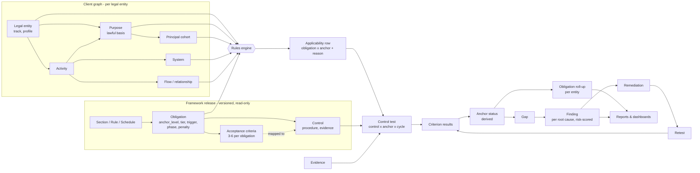
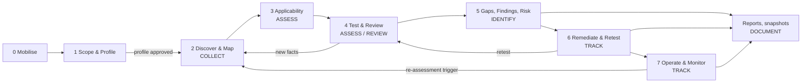
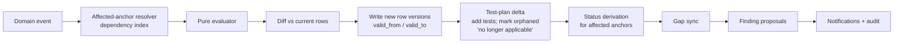
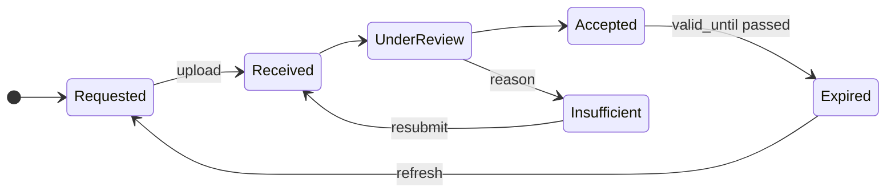
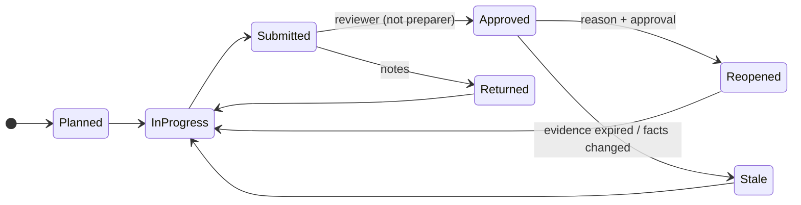
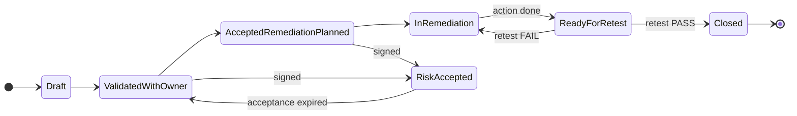
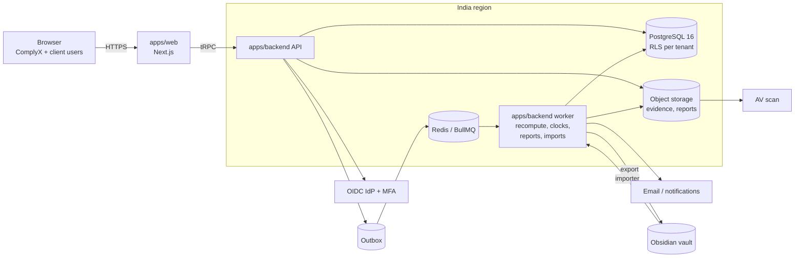
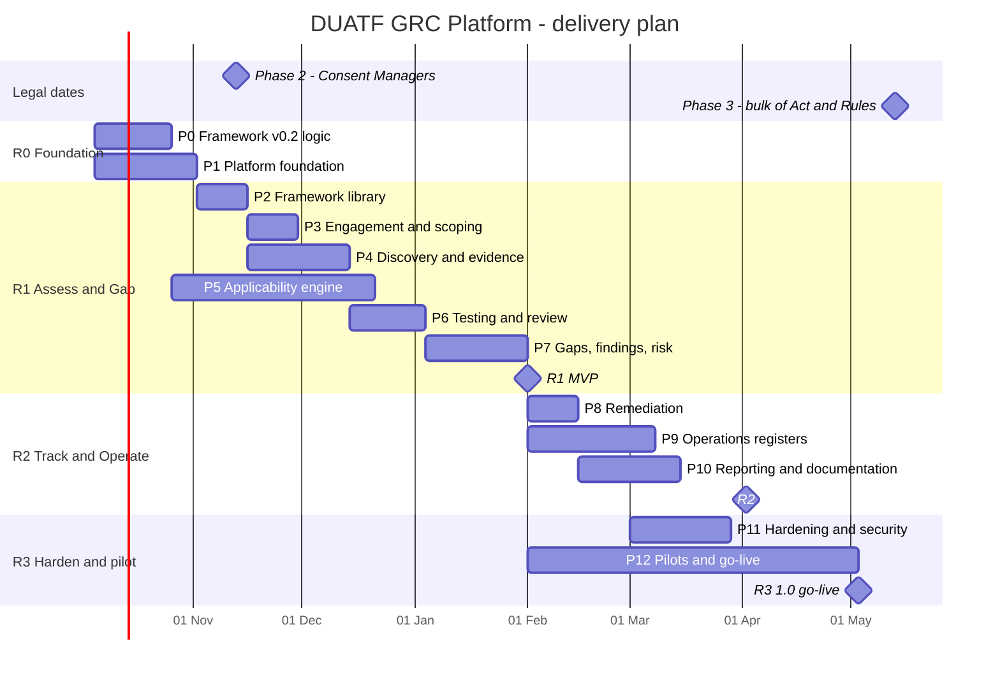
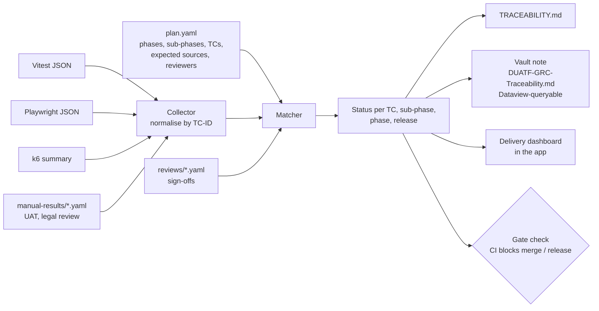

# DUATF GRC Platform - Application Plan (v0.1, 29 Sep 2026)

> A web application that runs the whole DUATF lifecycle for DPDP Act 2023 + DPDP Rules 2025 engagements. It covers six jobs: **Assess, Collect, Review, Identify gaps, Track, Document**. The legal logic comes from this vault, and the backend flow is driven by a rules engine. The plan below breaks the build into phases and sub-phases. Every sub-phase has tests with expected results and a review gate. Test results are matched to expectations automatically in CI (section 13).
>
> This plan builds on [[DUATF-Knowledge-Handoff]]. It is a working plan, not legal advice. Dates for Phase 2 (13 Nov 2026) and Phase 3 (13 May 2027) are computed and may shift by one day.

**Contents**
- Part A - What we are building: 1 Starting point · 2 Goals & scope · 3 Users & roles
- Part B - Backend business flow: 4 The golden thread · 5 End-to-end flow · 6 Rules engine & dynamic status · 7 Business rules · 8 State machines
- Part C - System design: 9 Data model · 10 Architecture
- Part D - Delivery: 11 Roadmap · 12 Phases, sub-phases, tests & reviews · 13 Test strategy & dynamic result matching
- Part E - 14 Risks · 15 Decisions needed · 16 First two weeks

---

# Part A - What we are building

## 1. Starting point (verified on 29 Sep 2026)

### 1.1 What the vault gives us (reused, not rewritten)

| Vault asset | Count (verified) | Becomes in the app |
|---|---|---|
| Act sections / Rules / Schedules / Lawful-basis codes | 44 / 23 / 8 / 19 | Legal library (read-only, versioned) |
| Domains | 18 (D01-D18) | Reporting axis, heatmap rows |
| Obligations | 99 (92 `OBL-*` + 7 `LNK-*`) | Rules-engine input (triggers, phase, penalty tier) |
| Controls | 82 (with ISO 27001/27701, NIST CSF crosswalk) | Test library |
| Process templates | 124 (41 common + 83 sector) | Discovery accelerators ("instantiate from catalogue") |
| Sector overlays | 20 | Regulators, parallel laws, retention anchors, hotspots |
| Data elements | 91 | Data catalogue picklist with context tags |
| Vocabularies | 17 | Enumerations (roles, flags, test types, rating, risk, finding status...) |
| Templates | 22 | Form schemas for each object type |
| Playbooks | Methodology (stages 0-7), Scoping questionnaire (25 Q), Role decision tree, Question bank, PBC list (34 items), Stuck-Point Playbook (SP-01..SP-25) | Guided workflows, wizards, contextual help |
| Engine | `engine/dpdp_engine.py` (v1, per-activity) | Test oracle; ported to TypeScript |
| Worked example | DemoPay: 6 activities, 6 systems, 7 third parties, 13 flows, 6 purposes, 5 tests, 4 findings, 4 remediations | Seed tenant + end-to-end test fixture |

### 1.2 Golden baseline of the v1 engine (captured today, run on a scratch copy)

| Activity | Applicable / 99 |
|---|---|
| ACT-DEMO-ADM-001 | 46 |
| ACT-DEMO-CUS-001 | **67** (matches the handoff's validated figure) |
| ACT-DEMO-CUS-002 | 63 |
| ACT-DEMO-CUS-003 | 54 |
| ACT-DEMO-HR-001 | 64 |
| ACT-DEMO-MKT-001 | 67 |

| Single-context probe (v1) | Applicable |
|---|---|
| Data Fiduciary, consent, no flags | 54 |
| DF, consent + `children` + `tracking_ads` | 60 |
| DF + SDF notified, consent | 61 |
| State instrumentality, `s7b` | 37 |
| DF, `ex17_1d` only | 22 |
| DF, `ex17_2b` only | 7 |
| Processor only | 7 |

| As-of date | Obligations in force |
|---|---|
| 2026-09-29 (today) | 7 (the `LNK-*` Indian-law duties) |
| 2026-11-13 (Phase 2) | 13 (+6 `OBL-CMO-*`) |
| 2027-05-13 (Phase 3) | 99 |

These numbers are the first golden fixtures. Section 13 explains how tests compare against them dynamically instead of hard-coding them.

### 1.3 What is not done yet (the app must not bake these in wrongly)
- **v0.2 is not applied.** 0 of 99 obligations have `anchor_level`, 0 have `acceptance_criteria`, there is no `tier`, and there is no processor track (G1, G3, G5, G6).
- **Processor track missing.** The processor-only probe returns 7 obligations. None of them is a processor duty.
- **No sunset date.** `LNK-SPDI-01` has an `in_force` date but no `in_force_until`. SPDI Rules stop applying when s.44(2) commences (Phase 3), but the engine would keep it live.
- **Basis on the activity, not the purpose.** Example: `ACT-DEMO-CUS-001` has basis `s7d + consent`, but its only purpose, `PUR-DEMO-001`, carries `s7d`. The consent-based purpose is missing (G-gap "retailer bundled consent" in miniature).
- **Pilot client folder is empty.** `20 Client/Nadall/` has no notes. The handoff calls the client "Mallard". The name needs confirming (section 15).

---

## 2. Goals and scope

### 2.1 Product goals
| # | Goal | Measure |
|---|---|---|
| PG-1 | One system of record for a DPDP engagement, from scoping to board report | No off-tool spreadsheets needed in pilot |
| PG-2 | **Compute, never type, compliance status.** Status is derived from test results against acceptance criteria | 0 manually typed obligation statuses; overrides audited |
| PG-3 | One finding per root cause (fixes G1) | <= 1.2 findings per root cause in pilots |
| PG-4 | Time-aware: phase dates, readiness vs compliance mode, re-assessment triggers (fixes G8) | Status labels switch automatically on commencement |
| PG-5 | Continuous after the assessment: BAU registers feed control tests | Rights/breach SLAs create exceptions automatically |
| PG-6 | Every result explainable and auditable | Every applicable/N/A row has a reason trace; audit log hash-verified |
| PG-7 | ComplyX-branded deliverables in one click, reproducible from a locked snapshot | Same snapshot gives the same report hash |
| PG-8 | The platform is itself DPDP-compliant (it stores client personal data) | Platform tenant assessed with DUATF before go-live |

### 2.2 The six jobs mapped to modules
| Job | What the user does | Module(s) |
|---|---|---|
| **Assess** | Scope the entity, run applicability, plan and execute control tests | Engagement & Scoping, Applicability, Testing |
| **Collect** | Map processing as a graph, request and receive evidence (PBC) | Discovery Graph, Evidence |
| **Review** | 4-eyes review of tests, findings, overrides, profiles; legal interpretation log | Review workflow (in Testing/Findings), Interpretation Log |
| **Identify (GAP)** | See every unmet acceptance criterion, grouped into findings, risk-scored | Gap register, Findings & Risk, Roadmap |
| **Track** | Drive remediation, retest, risk acceptance; run BAU registers | Remediation, Operations |
| **Document** | Dashboards, branded reports, snapshots, RoPA, audit pack, vault export | Reporting, Audit trail |

### 2.3 Out of scope for v1.0
- Giving legal opinions automatically. The tool records the assessor's position and rationale in the Interpretation Log.
- Being a Consent Management Platform. We **assess** consent capture; we don't collect end-user consent.
- DLP or data discovery scanning. Scan results can be imported as evidence.
- Mobile app. The web app will be responsive; a field-capture app can come later.

---

## 3. Users, roles and access

**Operating-model assumption (confirm in section 15):** ComplyX consultants lead the assessment. Client staff take part through a client portal: they answer questions, upload evidence, own findings and remediation, and run BAU registers. A self-assessment mode (client staff act as assessors, with an independent reviewer) is a configuration of the same roles, not a separate product.

### 3.1 Roles
| Side | Role | Main capabilities |
|---|---|---|
| ComplyX | Platform Admin | Tenants, SSO, platform settings (no client data access by default) |
| ComplyX | Framework Curator | Import and publish framework releases, maintain Interpretation Log defaults, regulatory change |
| ComplyX | Engagement Lead | Create engagements and cycles, approve overrides, approve findings for release, sign reports |
| ComplyX | Assessor | Discovery, run the engine, execute tests, draft findings |
| ComplyX | Reviewer (QA) | Approve or return tests, findings and overrides. Must not be the preparer (SoD) |
| Client | Client DPO / Privacy Lead | Manage client users, approve entity profile, accept findings, risk acceptance up to threshold, run registers |
| Client | Department SPOC | Answer discovery questions, validate mapping for the department |
| Client | Control / Evidence Owner | Respond to PBC requests, upload evidence |
| Client | Remediation Owner | Update actions, request retest |
| Client | Executive Viewer | Dashboards and reports; sign risk acceptance for Critical/High |
| External | Auditor (time-boxed) | Read-only access to a locked snapshot |

### 3.2 Scoping of access
Access = role x scope. Scope is one of: tenant (client group), legal entity, department, or engagement. A SPOC for `DEP-ACME-HR` sees only HR objects plus shared objects (systems, third parties) that HR activities link to.

### 3.3 Segregation of duties (enforced by the backend)
- The preparer of a test, finding or override cannot approve it.
- The approver of a risk acceptance must hold at least the level set for that severity: Critical/High = Executive Viewer, Medium/Low = Client DPO.
- Framework releases need a second curator to approve before publishing.

---

# Part B - Backend business flow

## 4. The golden thread

Every screen and every backend job is a step along this chain. The law sits at one end and remediation evidence at the other. Nothing is typed twice. Each step derives from the one before and can be traced back.



Anchors (v0.2, fixes G1) are the objects an obligation is evaluated against:

| Anchor level | Anchor object | Example obligations |
|---|---|---|
| `entity` | Legal entity | DPO/contact publication, grievance mechanism, breach capability, SDF duties, rights publication |
| `purpose` | Purpose | Lawful basis, notice, consent, withdrawal, retention, s.7 justification |
| `cohort` | Principal cohort (children, PwD, legacy, nominees) | Verifiable parental consent, no tracking of children, legacy notice |
| `flow` | Flow or third-party relationship | Processor contract, cross-border, DF-to-DF sharing, accuracy of disclosed data |
| `system` | System | R6 security safeguards, logging, backups, 1-year log retention, deletion |

The **Activity** stays the unit of discovery (it is how people describe their work). "What applies to this activity" becomes a derived view: the union of the anchors the activity touches. This keeps the v1 user experience and removes the duplication.

---

## 5. End-to-end business flow (backend view)

The flow follows the eight stages of [[Engagement Methodology]] (0-7). Stages 2-4 loop. For each stage below: the trigger, the system actions, the gate the backend checks before the stage can close, and the events it emits.



### Stage 0 - Mobilise
- **Trigger:** Engagement Lead creates an engagement for a client tenant.
- **System actions:**
  - Create the tenant (group), the legal entities, the engagement and the first **cycle**. A cycle holds `mode`, `as_of`, `scope` and the pinned `framework_release`.
  - Load the RACI template and invite client users.
  - Generate the **PBC list** from the 34 framework items, filtered by track, tier and sector. Assign owners and due dates.
- **Gate:** sponsor recorded; a SPOC is named for each in-scope department; PBC issued.
- **Events:** `EngagementCreated`, `CycleOpened`, `PbcIssued`.

### Stage 1 - Scope & Profile
- **Trigger:** cycle is opened.
- **System actions:**
  - Run the 25-question [[Entity Scoping Questionnaire]] per legal entity. A rule table converts answers into **entity facts**. For example, Q17 (e-commerce >= 2 crore users) sets `third_schedule`, Q7 (processes on behalf of clients) adds the `processor` track, and Q9 adds the `consent_manager` track.
  - Run the [[Role Determination Decision Tree]] wizard per business line, producing a **role track** per line: fiduciary, processor or consent manager.
  - Select sector overlays. This suggests process templates, regulators and retention anchors.
  - Record s.17 claims in the exemption register: clause, scope, conditions and a legal-opinion evidence link.
  - Show an SDF-likelihood indicator. This is advisory; `sdf_status` changes only on a notification.
- **Gate:** the client Legal/DPO **and** the Engagement Lead approve the entity profile. The approved profile is versioned, and any later change triggers re-assessment.
- **Events:** `EntityProfileApproved`, `EntityProfileChanged`.

### Stage 2 - Discover & Map (COLLECT)
- **Trigger:** profile approved (a draft can start earlier).
- **System actions:**
  - Instantiate processes from the catalogue.
  - Run workshops in guided mode from the [[Discovery Question Bank]]. Each answer creates or links graph objects: activity, purpose (with basis), cohort, data elements, systems (including shadow systems), third parties (roles and rationale), flows, data events, notices, retention rules and consent record types.
  - Bulk-import from Excel or an existing vault client folder.
  - Collect evidence through the PBC portal.
  - Track `confidence` on every flow and activity. Low-confidence items go into a **discovery backlog** (SP-01).
- **Gate** (system-computed, from the methodology exit criteria):
  - >= 90% of in-scope departments mapped;
  - every activity has a purpose, a basis (through its purposes) and a system;
  - every consent purpose has a notice;
  - every third party has a role;
  - every flow has a transfer type.
- **Events:** `GraphNodeChanged(type, id, fields)`, `EvidenceReceived`.

### Stage 3 - Applicability (ASSESS)
- **Trigger:** any `GraphNodeChanged` or `EntityProfileChanged`, a framework release upgrade on the cycle, or a manual run.
- **System actions:**
  - The rules engine (section 6) evaluates every obligation against every relevant anchor.
  - It writes **applicability rows**, each with a reason trace.
  - It diffs against the previous run and proposes overrides where the assessor disagrees. An override needs approval and a link to an Interpretation Log entry.
- **Gate:** Legal/Engagement Lead reviews the applicability run. N/A rows must have reasons (BR-01), and every override must be approved.
- **Events:** `ApplicabilityRecomputed(diff)`.

### Stage 4 - Test & Review (ASSESS / REVIEW)
- **Trigger:** an approved applicability run.
- **System actions:**
  - Generate the **test plan**: applicable (obligation, anchor) pairs → mapped controls → test instances (control x anchor). Obligations in penalty tiers P1-P3 (Rs 200-250 crore) are mandatory.
  - Assessors execute each test against its acceptance-criteria checklist, recording test type, population and sample, and linking evidence.
  - The assurance validator applies BR-05/06/07.
  - The reviewer approves or returns the test.
  - On approval, **status derivation** runs: criteria → anchor status → obligation roll-up → domain score → entity readiness index.
- **Gate:** all mandatory tests are approved. Coverage of the remaining tests is shown and does not block.
- **Events:** `TestSubmitted`, `TestApproved`, `CriterionResultChanged`, `AnchorStatusChanged`, `RollupChanged`.

### Stage 5 - Gaps, Findings, Risk (IDENTIFY)
- **Trigger:** `AnchorStatusChanged` to Not met or Partially met.
- **System actions:**
  - Open a **gap** for each (obligation, anchor) that is not met.
  - The finding composer groups gaps by root-cause key (failing control x anchor) into proposed **findings**. Impacted activities are listed through the graph; one finding is not created per activity.
  - The risk engine suggests impact from the penalty-tier floor plus context and cohort uplift. The assessor sets likelihood; the system computes score and band.
  - The client owner validates the finding.
  - The roadmap builder assigns findings to workstreams with target dates aligned to the phase dates.
- **Gate:** every finding has one owner, one anchor, a risk score and a status of Accepted or later. The management-accepted roadmap is recorded.
- **Events:** `GapOpened`, `GapClosed`, `FindingProposed`, `FindingStateChanged`.

### Stage 6 - Remediate & Retest (TRACK)
- **Trigger:** a finding is accepted.
- **System actions:**
  - Create remediation actions, with reminders and escalations.
  - When the owner marks an action done, the finding moves to **Ready for retest** and a retest instance is created for the same control x anchor.
  - A retest that passes closes the gap, closes the finding and recomputes the roll-up. A retest that fails sends the finding back to In remediation.
  - Signed risk acceptance with an expiry date is an alternative to remediation.
- **Events:** `RemediationDue`, `RetestRequested`, `FindingClosed`, `RiskAccepted`, `RiskAcceptanceExpired`.

### Stage 7 - Operate & Monitor (TRACK)
- **Trigger:** go-live of BAU, which must happen before 13 May 2027.
- **System actions:**
  - **Registers:** rights requests, breaches, DPIAs, vendor reviews, authority requests, consent record types, evidence expiry, regulatory change.
  - **Clock jobs:** CERT-In 6h, Board 72h, rights 90 days, internal SLAs.
  - **Continuous control monitoring:** register metrics per period become criterion results on designated tests. For example, rights requests closed within SLA < threshold makes a criterion FAIL, which opens a gap.
- **Re-assessment triggers** (mode = re-assessment): a new product, a new vendor, a regulatory notification, SDF designation or a breach. These mark the affected anchors stale and open a delta cycle.
- **Commencement job** (daily): when a phase date passes, obligations go live. Readiness gaps turn into compliance gaps and the owners are notified.
- **Events:** `BreachClockBreached`, `RightsSlaAtRisk`, `RegulatoryChangePublished`, `PhaseCommenced`, `EvidenceExpired`.

### Document (runs through every stage)
- Dashboards update live.
- Reports are generated only from a locked **snapshot** of a cycle, so the same snapshot always gives the same report.
- Report types: gap report, obligation compliance matrix, readiness roadmap, RoPA, board pack, audit pack, and the quarterly KPI pack.
- Every change is written to the append-only audit log.

---

## 6. Rules engine and dynamic status derivation (v0.2)

The engine is a **pure function** (`core-rules-engine`) with no I/O. Given the same inputs it always gives the same output, and the output carries its own explanation. The Python v1 engine stays as the **oracle** in CI.

### 6.1 Evaluation context
```text
EntityContext   { entity_id, tracks[fiduciary|processor|consent_manager|state], sdf_status,
                  third_schedule, online_presence, consent_manager_used, exemptions[], sectors[] }
PurposeContext  { purpose_id, lawful_basis[], flags[] (union from activities serving it), cohorts[] }
CohortContext   { cohort_id, principal_type, is_child, is_pwd, legacy, volume }
FlowContext     { flow_id | relationship_id, transfer_type, recipient_role, cross_border, country }
SystemContext   { system_id, holds_pd, sanctioned, hosting, country }
CycleContext    { as_of, mode[readiness|compliance|reassessment], framework_release }
```

### 6.2 Trigger semantics
The v1 trigger keys are kept: `always`, `role`, `basis`, `flags`. **AND** applies across keys and **OR** within a list. v0.2 adds:
- `anchor_level`: which anchors the obligation is evaluated against;
- `track`: fiduciary / processor / consent_manager / state (from G5; replaces the "actor gate");
- `tier`: core / extended / sdf. This controls whether the obligation is evaluated at all (core = always for the track; extended = only when the trigger fires; sdf = only on notification);
- `in_force` + `in_force_until`: the effective window. This fixes the SPDI sunset;
- `cohort` predicates for cohort-level triggers: `is_child`, `is_pwd`, `legacy`.

### 6.3 Exemptions (kept from v1, then extended)
The s.17(1), s.17(2), s.17(3) and s.17(4) logic moves into v0.2 unchanged. It is evaluated at purpose level, because exemptions attach to purposes, not activities. v1 parity is tested (TC-5.1-01, TC-5.3-07). The open question "does s.17(1) remove s.8(6) breach intimation?" is **not** decided in code. It is read from the Interpretation Log position that the cycle's release points to.

### 6.4 Modes and time
- **Readiness** mode (`as_of` < obligation `in_force`): the obligation is evaluated and tested. Gaps are labelled `readiness`, and the target date defaults to `in_force` minus a buffer (30 days, configurable).
- **Compliance** mode (`as_of` >= `in_force`): gaps are labelled `compliance`.
- **Re-assessment** mode: a delta cycle covering only the stale anchors, triggered by the events in Stage 7.
- Phase dates live in the framework release as data (13 Nov 2026 and 13 May 2027). A +1-day correction is a release change, not a code change.

### 6.5 Status derivation (the dynamic core)

The system computes status in four layers. Nobody types an obligation status. The only exception is an approved override, which is audited.

**Layer 1 - Criterion result** (per test, per acceptance criterion):
`PASS | PARTIAL | FAIL | NA | NOT_TESTED | INSUFFICIENT_ASSURANCE`.
- A PASS based only on an Inquiry test is stored as INSUFFICIENT_ASSURANCE (BR-05).
- If several approved tests cover the same criterion: any FAIL gives FAIL; otherwise, at least one PASS gives PASS. Conflicting results are flagged for the reviewer.

**Layer 2 - Anchor status** (per obligation x anchor). Rules are applied in order:

| Order | Rule | Status |
|---|---|---|
| 1 | Obligation not applicable at this anchor | NA (not in the set) |
| 2 | All criteria NA (reason required) | NA |
| 3 | Any **critical** criterion FAIL | NOT_MET |
| 4 | All non-NA criteria FAIL | NOT_MET |
| 5 | Any FAIL or PARTIAL | PARTIALLY_MET |
| 6 | Any NOT_TESTED or INSUFFICIENT_ASSURANCE | NOT_YET_TESTABLE |
| 7 | All non-NA criteria PASS | MET |

An obligation with no criteria authored yet gets one implicit critical criterion, "Requirement met as stated".

**Truth table (golden fixture for TC-6.5-01).** `c:` marks a critical criterion.

| # | Criteria results | Expected anchor status |
|---|---|---|
| 1 | c:PASS, PASS, PASS | MET |
| 2 | c:PASS, PASS, NA | MET |
| 3 | c:FAIL, PASS, PASS | NOT_MET |
| 4 | c:PASS, FAIL, PASS | PARTIALLY_MET |
| 5 | c:PARTIAL, PASS | PARTIALLY_MET |
| 6 | c:PASS, NOT_TESTED | NOT_YET_TESTABLE |
| 7 | c:NOT_TESTED, FAIL | PARTIALLY_MET |
| 8 | c:FAIL, NOT_TESTED | NOT_MET |
| 9 | FAIL, FAIL (none critical) | NOT_MET |
| 10 | NA, NA | NA |
| 11 | c:INSUFFICIENT_ASSURANCE, PASS | NOT_YET_TESTABLE |
| 12 | (no criteria) implicit c:PASS | MET |

**Layer 3 - Obligation roll-up per legal entity** (fixes G9): the worst status across the obligation's anchors, in the order NOT_MET > PARTIALLY_MET > NOT_YET_TESTABLE > MET. NA is ignored, and all-NA gives NA. The roll-up also shows **coverage** (anchors with a final status / applicable anchors) and drills down to each anchor.

**Layer 4 - Scores:**
- Domain score and entity readiness index = sum of (w x s) / sum of w over non-NA, tested obligations.
- s: MET = 1, PARTIALLY_MET = 0.5, NOT_MET = 0.
- w by penalty tier: P1 = 5, P2/P3/P4 = 4, P7 = 2, other = 1. These weights are configurable in the release.
- Coverage is always shown next to the score, so a high score on low coverage cannot mislead.

**Maturity (0-4, optional, G2)** is recorded per control test using the [[Rating Scale]]. It drives the roadmap, not findings. It is validated by BR-06.

### 6.6 From gaps to findings (deduplication)
- **Gap** = an (obligation, anchor) pair whose status is NOT_MET or PARTIALLY_MET. Gaps are opened and closed automatically as status changes.
- **Root-cause key** = (failing control, anchor type, anchor id), or (obligation, anchor) when no control is mapped.
- **Proposed finding** = one per root-cause key. It lists every obligation affected and every impacted activity (through the graph).
  - Example: `CTL-NOT-01` failing at `PUR-DEMO-001` gives one finding covering OBL-NOT-01..04. This is exactly the shape of the existing FND-DEMO-001, so the vault already validates the approach.
- Assessors may merge or split proposed findings with a reason. The duplication ratio is measured (TC-7.2-02).

### 6.7 Risk scoring (from [[Risk Scales]])
- **Likelihood L1-L5** is set by the assessor, with the vocabulary shown as guidance.
- **Suggested impact** is the maximum of three floors:
  - Penalty-tier floor: P1 (s.8(5) security, Rs 250 cr) = I5; P2 (breach intimation), P3 (children), P4 (SDF) = I4; P7 (other, Rs 50 cr) = I2; P5 (DP duties) = I1; P6 = the floor of the underlying breach.
  - Context uplift: a sensitive context tag (health, biometric, financial, gov_id) gives at least I3. The same at scale (volume >= threshold, configurable) gives at least I4.
  - Cohort uplift: children + sensitive + scale gives I5. A regulator/public-exposure flag gives I5.
- The assessor may raise impact. Lowering it below the floor is rejected, and any other lowering needs a justification.
- Score = L x I. Bands: 1-4 Low, 5-9 Medium, 10-16 High, 17-25 Critical.
- Check against the vault: FND-DEMO-001 is P7 with gov_id, biometric and financial context → I3; L5 x I3 = 15 → High. This matches the stored finding (TC-7.3-01).

### 6.8 Reason trace (every applicability row)
```json
{
  "obligation": "OBL-CON-01", "anchor": {"level": "purpose", "id": "PUR-DEMO-004"},
  "applies": true, "release": "0.2.0", "as_of": "2026-09-29", "mode": "readiness",
  "steps": [
    {"check": "track", "input": ["fiduciary"], "result": "pass"},
    {"check": "tier", "input": "extended", "result": "evaluate"},
    {"check": "exemption", "input": [], "result": "none"},
    {"check": "trigger.basis", "need": ["consent"], "have": ["consent"], "result": "pass"},
    {"check": "in_force", "date": "2027-05-13", "result": "not yet - readiness"}
  ],
  "interpretation_refs": [], "override": null
}
```

### 6.9 Incremental recompute pipeline


| Event | Affected set |
|---|---|
| `EntityProfileChanged` | All anchors of that entity |
| `GraphNodeChanged(purpose.basis)` | That purpose, its cohorts, activity views |
| `GraphNodeChanged(activity.flags)` | Purposes, cohorts, systems and flows reachable from the activity |
| `GraphNodeChanged(system or flow)` | That anchor only |
| `FrameworkReleaseUpgraded(cycle)` | All anchors in the cycle |
| `PhaseCommenced` / `as_of` change | Mode relabel only; no re-evaluation |

The jobs are idempotent (keyed by event id) and use a transactional outbox. Rows are never deleted: history is kept with `valid_from/valid_to`, so "what did we know on date X" can always be answered.

---

## 7. Business rules catalogue

| ID | Rule | Enforced where |
|---|---|---|
| BR-01 | Every N/A applicability row has a reason linked to a flag, exemption, tier, track or approved override | Engine + override service |
| BR-02 | An override needs a reason, an Interpretation Log link and approval by a different user | Override workflow |
| BR-03 | Lawful basis lives on the Purpose. An activity's basis is derived as the union of its purposes' bases | Graph model |
| BR-04 | One finding, one owner, one anchor. Never "Section X non-compliant" | Finding composer |
| BR-05 | A PASS based only on Inquiry is stored as INSUFFICIENT_ASSURANCE | Assurance validator |
| BR-06 | Maturity > 1 needs a test type stronger than Inquiry; maturity >= 3 needs Inspection, Observation, Re-performance, Technical test or Data analytics | Assurance validator |
| BR-07 | A criterion PASS needs >= 1 accepted, unexpired evidence item, or a working paper for Observation/Re-performance | Assurance validator |
| BR-08 | The preparer cannot approve their own test, finding, override, profile or release | SoD guard |
| BR-09 | Impact >= penalty-tier floor; lowering below it is rejected | Risk engine |
| BR-10 | Risk = L x I, with bands 1-4 / 5-9 / 10-16 / 17-25 | Risk engine |
| BR-11 | Risk acceptance approver level by severity; acceptance expires (default 12 months) and reopens for review | Risk acceptance |
| BR-12 | Finding status follows [[Finding Status]] transitions only (section 8) | State machine |
| BR-13 | Rights request: statutory due = received + 90 days (R14(3) outer limit); the internal SLA is configurable and shorter | Rights register |
| BR-14 | Breach: CERT-In due = aware + 6 h; Board initial "without delay" (internal target configurable); Board detailed report = aware + 72 h, extendable only by a recorded written request; affected DPs "without delay" | Breach register |
| BR-15 | Retention rules cannot be set below 1 year for logs and PD under R8(3); Third Schedule entities get the 3-year inactivity rule plus a 48 h pre-erasure notice | Retention rule form |
| BR-16 | Obligation live window = [`in_force`, `in_force_until`]; outside it the status is labelled readiness or retired | Engine |
| BR-17 | A cycle is pinned to one framework release; upgrading needs an impact preview and approval | Release service |
| BR-18 | Sector items marked `verify` cannot appear in a client deliverable until someone marks them verified, with a source and date | Report engine |
| BR-19 | Reports are generated only from a locked snapshot and carry the snapshot hash, release, `as_of` and the "not legal advice" disclaimer | Report engine |
| BR-20 | Evidence past `valid_until` expires, and the tests relying on it are flagged STALE for re-review | Evidence job |
| BR-21 | Each legal entity is a separate DF. Intra-group flows are `intra-group` unless a shared-services entity is recorded as processor (SP-06) | Graph model |
| BR-22 | A third party may hold several roles (processor + DF). Each role needs a rationale (SP-05) | Third-party form |
| BR-23 | Paper-only data is out of DPDP scope. Digitised data comes into scope from the digitisation event (SP-16) | Engine (digital_state) |
| BR-24 | Evidence marked as containing PD shows a redaction reminder and is excluded from the external auditor view unless explicitly released | Evidence service |

---

## 8. State machines

```mermaid
stateDiagram-v2
  direction LR
  state "Cycle" as CY {
    [*] --> Planned --> Mobilising --> Scoping --> Discovery --> Testing --> Reporting --> Closed
    Testing --> Discovery : new facts
    Closed --> [*]
  }
```


*Evidence*


*Control test*


*Finding (labels follow [[Finding Status]])*

| Object | States |
|---|---|
| Remediation | Not started → In progress ⇄ Blocked → Done → Verified (on retest PASS) |
| Override | Proposed → Approved / Rejected → Superseded (on new run) |
| Interpretation decision | Open → Position taken → Under review (on review date or Board guidance) → Position taken / Revised |
| Rights request | Received → Identity verification → In progress → Responded → Closed (grievance can reopen) |
| Breach | Detected → Triage → Contained → Notified (per clock) → Root cause → Closed |
| Framework release | Draft → In review → Published (immutable) → Superseded |

---

# Part C - System design

## 9. Data model

Four layers. Framework data is global and immutable per release. Everything else carries `tenant_id` and is isolated with Postgres row-level security.

```mermaid
erDiagram
  FRAMEWORK_RELEASE ||--o{ OBLIGATION : contains
  FRAMEWORK_RELEASE ||--o{ CONTROL : contains
  OBLIGATION ||--o{ ACCEPTANCE_CRITERION : has
  OBLIGATION }o--o{ CONTROL : satisfied_by
  ACCEPTANCE_CRITERION }o--o{ CONTROL : tested_by
  TENANT ||--o{ LEGAL_ENTITY : groups
  LEGAL_ENTITY ||--o{ DEPARTMENT : has
  DEPARTMENT ||--o{ PROCESS : owns
  PROCESS ||--o{ ACTIVITY : contains
  ACTIVITY }o--o{ PURPOSE : serves
  PURPOSE }o--o{ COHORT : about
  ACTIVITY }o--o{ SYSTEM : runs_on
  ACTIVITY ||--o{ FLOW : emits
  FLOW }o--|| THIRD_PARTY : to
  LEGAL_ENTITY ||--o{ CYCLE : assessed_in
  CYCLE ||--o{ APPLICABILITY_ROW : computes
  APPLICABILITY_ROW ||--o{ CONTROL_TEST : planned_as
  CONTROL_TEST ||--o{ CRITERION_RESULT : records
  CONTROL_TEST }o--o{ EVIDENCE : supported_by
  APPLICABILITY_ROW ||--|| ANCHOR_STATUS : derives
  ANCHOR_STATUS ||--o| GAP : opens
  GAP }o--|| FINDING : grouped_into
  FINDING ||--o{ REMEDIATION : fixed_by
  REMEDIATION ||--o| CONTROL_TEST : retested_by
```

| Layer | Main tables (key fields) |
|---|---|
| **Framework** (global, per release) | `framework_release` (semver, status, phase_dates, weights) · `instrument` (section/rule/schedule) · `lawful_basis` · `domain` · `obligation` (code, anchor_level, tier, track, trigger jsonb, sec, phase, in_force, in_force_until, penalty_tier, regime) · `acceptance_criterion` (obligation, seq, text, critical) · `criterion_control` · `control` (type, nature, frequency, owner_role, procedure, evidence_expected, crosswalk jsonb) · `obligation_control` · `process_template` · `sector_overlay` (regulators, laws, retention_anchors with confidence) · `data_element` · `vocabulary_term` · `pbc_item` · `question_bank_item` · `stuck_point` · `interpretation_default` · `notification_log` |
| **Client graph** (tenant) | `tenant` · `legal_entity` (code ORG-, tracks[], sdf_status, third_schedule, online_presence, cm_used, sectors[], regulators[], dpo_contact) · `profile_answer` (versioned) · `exemption_claim` · `department` · `process` · `activity` (digital_state, flags[], context_tags[], volume, confidence) · `purpose` (lawful_basis[], justification, interpretation_id) · `cohort` (principal_type, is_child, is_pwd, legacy, volume) · `activity_purpose` · `purpose_cohort` · `data_element_use` · `system` (type, sanctioned, hosting, country, encryption, logging, rights_lookup_key) · `third_party` (roles[], role_rationale, country, dpa_status, dpa_r6, breach_sla_h, sub_processors) · `flow` (from, to, transfer_type, cross_border, country, confidence) · `data_event` · `notice` (R3 checklist, version, languages) · `retention_rule` (legal_basis_for_retention, third_schedule, notice_48h) · `consent_record_type` · `interpretation_decision` · `graph_revision` |
| **Assessment** (tenant, per cycle) | `engagement` · `cycle` (mode, as_of, release_id, scope, stage) · `raci` · `applicability_run` · `applicability_row` (obligation, anchor_level, anchor_id, applies, trace jsonb, valid_from/to) · `override` · `control_test` (control, anchor, type, population, sample, preparer, reviewer, state, maturity) · `criterion_result` · `evidence` (file, sha256, pbc_ref, status, valid_until, contains_pd) · `evidence_link` · `anchor_status` (status, inputs_hash, computed_at) · `obligation_rollup` (status, coverage) · `gap` (kind readiness/compliance) · `finding` (root_cause_key, L, I, score, band, owner, state, target) · `finding_gap` · `risk_acceptance` · `remediation` · `review_note` · `signoff` · `snapshot` (hash) |
| **Operations** (tenant) | `rights_request` (pseudonymous subject ref, right, channel, verified, systems_searched, processors_notified, due_statutory, due_internal) · `breach` + `breach_clock` · `dpia` · `vendor_review` · `authority_request` (confidentiality_direction) · `regulatory_change` + `change_impact` · `kpi_snapshot` |
| **Platform** | `user` · `membership` (tenant, role, scope) · `audit_event` (hash chain) · `outbox_event` · `notification` · `job_run` · `file_object` · `report_run` |

**IDs.** Every row has a UUID primary key plus the human DUATF code from the [[Graph Modelling Guide]] (ORG-, DEP-, PRC-, ACT-, EVT-, PUR-, SYS-, TP-, FLW-, NTC-, RET-, OBL-, CTL-, TST-, EVD-, FND-, REM-). Codes are generated sequentially per tenant and are immutable. This keeps vault export and import lossless.

**Graph queries** use recursive CTEs over the link tables, which is enough at this scale (hundreds of activities, thousands of edges); no separate graph DB is needed. Example: "which third parties receive health data" is a join from `data_element_use` (context health) → `activity` → `flow` → `third_party`.

## 10. Architecture

### 10.1 Repository layout
The layout follows the Turborepo convention used in this workspace: `apps/* → feature-* → platform-* → core-*`, with no upward imports and named exports only. All application code lives in **`D:\Code\DPDPA\Source-Code`**, next to the vault. The vault stays the framework source and the importer reads it through a configured path; no app code goes inside the vault.

```text
Source-Code/
  apps/
    web/          Next.js App Router - assessor workspace, client portal, admin
    backend/      Fastify + tRPC API, REST (exports, webhooks); second entrypoint = worker (jobs, clocks, recompute, reports)
    e2e/          Playwright journeys, one suite per phase
  packages/
    core-types/            zod schemas + TS types for every object (shared FE/BE)
    core-rules-engine/     pure: applicability, derivation, roll-up, risk, dedupe (no I/O)
    core-vault-format/     pure: parse/serialise Obsidian notes (YAML frontmatter, [[links]])
    core-trpc/             router contracts + client
    core-ui/               design system: tokens, data table, forms, status pills, graph canvas wrapper
    core-utils/            IST dates & business clocks, ID generator, formatting
    core-config/  core-i18n/
    platform-db/           Drizzle schema, migrations, RLS policies, repositories
    platform-auth/         OIDC, sessions, permission checks, SoD guard
    platform-jobs/         BullMQ queues, outbox relay, scheduler, clock jobs
    platform-storage/      S3 client, SHA-256, AV scan, signed URLs
    platform-reporting/    DOCX / PDF / XLSX renderers, ComplyX brand kit
    feature-framework-library
    feature-engagement          feature-engagement-scoping
    feature-discovery           feature-discovery-graph  feature-discovery-workshop  feature-discovery-import
    feature-evidence
    feature-applicability
    feature-testing             feature-testing-review
    feature-findings            feature-findings-risk    feature-findings-roadmap
    feature-remediation
    feature-operations          feature-operations-rights  feature-operations-breach
                                feature-operations-dpia    feature-operations-vendors  feature-operations-regchange
    feature-reporting
    feature-admin
  tools/
    traceability/   plan.yaml, collector, gate checker, report writer (section 13)
    oracle/         pinned Python v1 engine runner for differential tests
  fixtures/
    golden/v1/      oracle outputs (matrix, counts)
    scenarios/      6 stress-test mini-vaults + SME-signed expected results
    demopay/        seed tenant
  plan/
    plan.yaml  manual-results/  reviews/
```

### 10.2 Runtime view


### 10.3 Technology choices
| Concern | Choice | Why |
|---|---|---|
| Language | TypeScript (strict) end to end | One type system from DB to UI; matches the workspace conventions |
| Web | Next.js App Router, Tailwind, `core-ui` | Server components for heavy tables; team skills |
| Graph view | Cytoscape.js | Handles 1,000+ nodes; filters and layouts |
| API | tRPC internally; REST + OpenAPI for exports and integrations | Type-safe internal calls; stable external contract |
| Database | PostgreSQL 16 + Drizzle ORM | RLS for tenancy, recursive CTEs for graph traversal, JSONB for triggers/traces, pg_trgm search |
| Jobs & clocks | BullMQ on Redis, transactional outbox | Reliable delayed jobs for 6 h / 72 h / 90 d clocks |
| Files | S3-compatible (AWS S3 Mumbai / MinIO locally), ClamAV | Versioned, hashed evidence |
| Identity | OIDC (Keycloak self-hosted in India, or Entra ID/Auth0), TOTP/WebAuthn MFA | SSO for client users |
| Reports | `docx` (DOCX), headless Chromium (PDF), ExcelJS (XLSX) | Branded, templated, reproducible |
| Tests | Vitest, fast-check (property), Testcontainers (Postgres), Playwright + axe, k6, Python oracle | See section 13 |
| Observability | OpenTelemetry, pino with PD redaction | No personal data in logs |
| Hosting | AWS ap-south-1 (Mumbai), DR in ap-south-2 (Hyderabad), or an Azure India pair | India data residency for client data |

### 10.4 API surface (tRPC routers, one per feature)
`framework.*` (releases, library, search, diff) · `engagement.*` (tenants, entities, cycles, RACI) · `scoping.*` (questionnaire, profile, exemptions, approval) · `graph.*` (CRUD per object, traverse, completeness, import/export) · `evidence.*` (PBC, upload, review, links) · `applicability.*` (run, rows, trace, overrides, diff) · `testing.*` (plan, execute, submit, review, derive) · `findings.*` (gaps, compose, risk, lifecycle, roadmap) · `remediation.*` · `ops.rights.*` · `ops.breach.*` · `ops.dpia.*` · `ops.vendors.*` · `ops.authority.*` · `ops.regchange.*` · `reports.*` (snapshot, generate, download) · `audit.*` · `admin.*`.

### 10.5 Security and privacy of the platform itself
The platform stores client personal data (rights logs, breach records, evidence). That makes ComplyX a **Data Processor** for each client, so the platform must pass its own framework.
- **Hosting and contracts:** India-only hosting and backups; a DPA template between ComplyX and each client, with R6 security clauses and a breach SLA.
- **Isolation and encryption:** tenant isolation through RLS plus API scope checks; TLS 1.2+; encryption at rest with a KMS; per-tenant storage prefixes.
- **Authentication:** MFA is mandatory for all users.
- **Audit:** an append-only audit log with a hash chain, exported daily to WORM storage.
- **Minimisation:** the rights register stores a pseudonymous subject reference, not full identity. Evidence has a `contains_pd` flag and a redaction reminder.
- **Retention:** client data is purged on engagement end, per the contract. Logs are kept for at least 1 year, in line with R8(3) and R6(e).
- **Standards and recovery:** OWASP ASVS L2 target. DR targets: RPO 15 min, RTO 4 h.
- **Dogfooding:** the platform's own processing is modelled as tenant `ORG-XYB` and assessed with DUATF before go-live (TC-11.5-01).

### 10.6 Vault and Excel interoperability
- **Framework import** (vault → release): the importer parses notes by `type`, validates them against JSON schemas and produces an immutable release plus an import report. It is idempotent and supports a dry-run diff.
- **Client import:** a vault client folder (DemoPay format) or the Master Register "Activity Register" sheet.
- **Client export** (app → vault): notes with the same YAML schema. Obsidian graph view, Dataview and the Python engine keep working on the export (TC-10.4-01).

---

# Part D - Delivery

## 11. Roadmap and releases

**Team assumption:** 1 tech lead, 3 full-stack developers, 1 QA/automation engineer, 1 framework/legal SME (ComplyX), a part-time designer, and a product owner. A smaller team stretches the timeline proportionally. Week 1 starts Monday 5 Oct 2026.

| Release | Phases | Target | Why this date |
|---|---|---|---|
| **R0 Foundation** | P0, P1 | 30 Oct 2026 | Correct logic and a safe platform before any client data |
| **R1 Assess & Gap (MVP)** | P2-P7 | ~1 Feb 2027 | Readiness assessments must run Feb-May 2027 (Readiness Roadmap window) |
| **R2 Track & Operate** | P8-P10 | ~2 Apr 2027 | Rights and breach registers must be live **before 13 May 2027** |
| **R3 Hardened 1.0** | P11, P12 | ~3 May 2027 | Pilot-validated go-live before Phase 3 |



P5 starts early. The v1 port and the differential harness need only the framework and the goldens; the v0.2 work follows in P0's output. P12 pilot 1 starts on the MVP, so real use shapes R2.

---

## 12. Phases, sub-phases, tests and reviews

**Conventions.**
- Test IDs are `TC-<phase>.<sub>-<nn>`. Every automated test carries its ID in its name, so results can be matched back to the plan (section 13).
- **Expected source** says where the expected value comes from:
  - `literal`: written here;
  - `golden`: a committed fixture file;
  - `oracle`: computed at test time by the Python v1 engine on the same input;
  - `sme`: an SME-signed scenario file.
- Each phase ends with a **review gate** and an **exit check**.

### P0 - Framework v0.2 logic (vault and engine)
**Goal:** get the framework logic right before writing application code. This covers handoff section 6, steps 1-7. **Depends on:** nothing. **Owners:** Framework curator + tech lead.

| Sub-phase | Deliverables |
|---|---|
| 0.1 Decisions & ADRs | Answers to section 15 decisions; ADR-001 stack, ADR-002 hosting, ADR-003 identity, ADR-004 engine port strategy, ADR-005 tenancy, ADR-006 release versioning |
| 0.2 Golden baseline freeze | `fixtures/golden/v1/` (matrix CSV, per-activity counts, probe counts, in-force counts), Python + PyYAML versions pinned |
| 0.3 Obligation schema v0.2 | `anchor_level`, `tier`, `track`, `in_force_until` on all obligations; `acceptance_criteria` (id, text, critical, controls) for all **core** obligations (~35); new processor-track obligations (contract compliance, R6 clauses, breach SLA to DF, erase on instruction, sub-processor approval, s.17(1)(d) split); JSON Schemas per note type |
| 0.4 Interpretation Decisions Log | New note with the 6 G4 items (reasonable time after withdrawal, scope of s.7(a), employee consent vs s.7(i), meaning of "approach" under R8, s.17(1) vs breach intimation, child when age unknown): options, position, rationale, risk if the Board disagrees, review date |
| 0.5 Model changes | Legal Entity + Group templates; `track` on the entity profile; Purpose carries `lawful_basis`; Cohort template; Control Test split into `compliance_status` + `maturity`; DemoPay migrated (missing purposes added) |
| 0.6 Scenario pack | 6 mini-vaults for the stress cases (hospital, SaaS processor, 40-entity bank group, edtech with children, 50-person startup, retailer with bundled consent), each with an SME-signed expected-results file |
| 0.7 Vault validator | Script: every note's YAML parses, schema check per `type`, no broken links outside templates, engine runs |

| Test | What | Expected | Source |
|---|---|---|---|
| TC-0.2-01 | v1 engine over the vault | 6 x 99 = 594 rows; ADM-001 46, CUS-001 67, CUS-002 63, CUS-003 54, HR-001 64, MKT-001 67 | oracle (snapshot shown) |
| TC-0.2-02 | In-force counts | 2026-09-29 → 7; 2026-11-13 → 13; 2027-05-13 → 99 | oracle |
| TC-0.2-03 | v1 probes | DF consent 54; + children/tracking_ads 60; SDF 61; State s7b 37; ex17_1d 22; ex17_2b 7; processor-only 7 | oracle |
| TC-0.3-01 | Schema coverage | 100% of obligations have a valid `anchor_level`, `tier`, `track` | literal |
| TC-0.3-02 | Criteria quality | Every core obligation has 3-6 criteria; each criterion maps to >= 1 control that maps back to the obligation | literal |
| TC-0.3-03 | SPDI sunset | `LNK-SPDI-01` live on 2027-05-12, not live on 2027-05-13 | literal |
| TC-0.3-04 | Processor track | Processor-only context → 0 fiduciary-track obligations; >= the SME-set count of processor-track obligations | sme |
| TC-0.4-01 | Interpretation Log | 6 entries, each with position + review date; each linked obligation back-links to it | literal |
| TC-0.5-01 | Basis migration | For 6/6 DemoPay activities, the union of purpose bases = the original activity basis (mismatches resolved by adding purposes) | golden |
| TC-0.6-01 | Scenario pack integrity | 6 scenarios load; each expected file carries a valid SME signature hash | sme |
| TC-0.7-01 | Validator | 0 YAML errors, 0 new broken links, engine exit code 0 | literal |

**Review gate:** a second legal reviewer checks the anchor/tier assignments and the criteria wording; the tech lead reviews the schemas. **Exit:** Framework Release `0.2.0-rc` frozen in the vault, goldens committed, ADRs approved.

### P1 - Platform foundation
**Goal:** a secure, observable, multi-tenant skeleton, plus the test traceability pipeline that tracks every later phase. **Depends on:** 0.1.

| Sub-phase | Deliverables |
|---|---|
| 1.1 Monorepo & CI/CD | Turborepo + pnpm, TS strict, ESLint dependency-direction rules, Vitest, Playwright; docker-compose (Postgres, Redis, MinIO, Keycloak, Mailpit, ClamAV); CI runs lint → typecheck → test → build → traceability; dev/staging/prod in the India region |
| 1.2 Identity & access | OIDC login, MFA, sessions; tenants, memberships, role x scope; permission matrix stored as data; SoD guard |
| 1.3 Data platform | Drizzle migrations, RLS policies, UUID + DUATF code generator, revision history, outbox table |
| 1.4 Audit & events | Hash-chained audit log, outbox relay → BullMQ, idempotent consumers, notification service (in-app + email) |
| 1.5 File storage | Upload pipeline: type/size allowlist → AV scan → SHA-256 → versioned object → signed URL; `contains_pd` flag |
| 1.6 Traceability harness | `plan/plan.yaml` (this section as data), TC tagging lint, result collector, gate checker, `TRACEABILITY.md` + vault note writer, Delivery dashboard page |
| 1.7 UI shell & design system | `core-ui` tokens and components, app shell, entity/cycle switcher, status pills for derived statuses |

| Test | What | Expected | Source |
|---|---|---|---|
| TC-1.1-01 | Boundary lint | A fixture with a `core-*` → `feature-*` import fails CI | literal |
| TC-1.2-01 | Permission matrix | Auto-generated test per (role, capability): allow/deny equals the matrix, 100% | golden (matrix) |
| TC-1.2-02 | SoD | Preparer approving own item → 403 + audit entry | literal |
| TC-1.3-01 | Tenant isolation | Tenant-A session reading tenant-B rows: 0 rows at DB (RLS), 404 at API | literal |
| TC-1.4-01 | Audit integrity | Tampering one audit row makes chain verification fail at that row | literal |
| TC-1.4-02 | Exactly-once effect | Event redelivered 3 times → one side effect | literal |
| TC-1.5-01 | Upload safety | EICAR test file quarantined; SHA-256 stored; expired signed URL → 403 | literal |
| TC-1.6-01 | Traceability | Plan TC with no test → MISSING; unknown TC in results → UNTRACED; one failing TC → sub-phase FAIL and gate blocks | literal |
| TC-1.7-01 | Accessibility | axe: 0 serious/critical on the shell | literal |

**Review gate:** threat model v1 (security), architecture review, code review. **Exit:** a user signs in with MFA to a tenant; CI is green; the traceability dashboard shows P0 and P1 results live.

### P2 - Framework library
**Goal:** the legal KB inside the app as versioned, immutable releases. **Depends on:** P0 (release rc), P1.

| Sub-phase | Deliverables |
|---|---|
| 2.1 Vault importer | Walk the vault, parse notes (`core-vault-format`), validate, map to tables, build the release bundle, import report, dry-run diff |
| 2.2 Release management | Draft → review → publish (immutable); diff between releases; cycles pin a release; upgrade impact preview |
| 2.3 Library UI | Browse and search Act, Rules, Schedules, obligations (triggers in plain English), controls (crosswalks), domains, overlays (retention anchors with confidence), process catalogue, data elements, vocabularies, playbooks (SP-01..25, question bank, PBC) |
| 2.4 Legal calendar | Commencement dates and notification log as release data; `verify` badges |

| Test | What | Expected | Source |
|---|---|---|---|
| TC-2.1-01 | Import counts | 44 sections, 23 rules, 8 schedules, 19 bases, 18 domains, 99 obligations (+ v0.2 additions), 82 controls, 124 templates (41 + 83), 20 overlays, 91 data elements, 17 vocabularies, 34 PBC items, 25 stuck points | oracle (counted from the vault at test time) |
| TC-2.1-02 | Referential integrity | Every obligation has >= 1 control; every control has >= 1 obligation; 0 dangling links | literal |
| TC-2.1-03 | Idempotency | Re-importing an unchanged vault → 0 changes; editing one note → diff shows exactly that field | literal |
| TC-2.1-04 | Profile check (v1 release) | actor: data_fiduciary 75, any 9, sdf 7, consent_manager 6, data_principal 1, state 1; phase: 3→86, 0→7, 2→6 | oracle |
| TC-2.2-01 | Immutability | Updating a published release → rejected; a cycle pinned to 0.2.0 is unchanged after 0.3.0 is published | literal |
| TC-2.3-01 | Search | "Rule 7" returns R7 and OBL-BRE-* | literal |
| TC-2.4-01 | Date shift | Moving the Phase 3 date to 2027-05-14 in a draft release moves the in-force date of all phase-3 obligations by exactly one day | literal |

**Review gate:** the curator spot-checks a 10% sample against the vault; UX review. **Exit:** release `0.2.0` published in the app, matching the vault.

### P3 - Engagement, entities and scoping (Stages 0-1)
**Goal:** know what law applies to each legal entity. **Depends on:** P2.

| Sub-phase | Deliverables |
|---|---|
| 3.1 Engagement model | Tenant/group, legal entities, engagement, cycle (mode, as_of, scope, release), RACI, client invites |
| 3.2 Scoping wizard | 25-question questionnaire per entity; answer → fact rule table; role decision-tree wizard per business line → tracks; SDF-likelihood indicator |
| 3.3 Overlays & exemptions | Sector overlay selection → suggestions; exemption register with evidence |
| 3.4 PBC issue | PBC list filtered by track/tier/sector; owners; due dates; client portal task list |
| 3.5 Profile approval | Two-party approval; profile versioning; change → `EntityProfileChanged` |

| Test | What | Expected | Source |
|---|---|---|---|
| TC-3.1-01 | Group model | A group with 3 entities → 3 profiles, each a separate DF; a flow between them is typed `intra-group` | literal |
| TC-3.2-01 | Fact derivation | Q17 yes → `third_schedule=true`; Q9 yes → track `consent_manager`; Q7 with clients → track `processor` | golden (rule table) |
| TC-3.2-02 | DemoPay reproduction | Questionnaire answers for DemoPay → profile equal to `ORG-DEMO Entity Profile` (role DF, SDF not notified, third_schedule false, online_presence true, cross_border true) | golden |
| TC-3.3-01 | Overlay suggestions | Selecting SEC-FIN suggests exactly the overlay's `process_templates` list | oracle (vault) |
| TC-3.4-01 | PBC filtering | A processor-only SaaS entity gets the SME-defined PBC subset (no consent-UI items; contract/security items included) | sme |
| TC-3.5-01 | Gate | A compliance-mode engine run on an unapproved profile is blocked; a readiness draft run is allowed and watermarked DRAFT | literal |

**Review gate:** an assessor walks through scoping with the pilot client's real data; legal reviews the question → fact table. **Exit:** Stage 1 exit criterion ("profile approved by Legal") is recorded in the app.

### P4 - Discovery graph and evidence collection (Stage 2 - COLLECT)
**Goal:** reconstruct the client's processing as a graph and collect evidence. **Depends on:** P3.1.

| Sub-phase | Deliverables |
|---|---|
| 4.1 Graph objects | CRUD for department, process (from catalogue), activity, purpose, cohort, data element use, system (shadow flag), third party (multi-role + rationale), relationship, flow, data event, notice (R3 checklist), retention rule (sector anchor), consent record type |
| 4.2 Workshop mode | Guided interview from the question bank; answers create and link objects; draft autosave |
| 4.3 Bulk import/export | Vault client folder import, Excel Activity Register import, CSV templates, vault export |
| 4.4 Graph explorer | Visual graph with filters; saved traversals (vendors receiving health data, activities per system, cross-border flows, child cohorts); confidence heatmap; discovery backlog |
| 4.5 Evidence portal | PBC request → upload → review (accept / insufficient) → versions → expiry; links to objects, controls and criteria |
| 4.6 Completeness checks | Stage 2 exit metrics computed live |

| Test | What | Expected | Source |
|---|---|---|---|
| TC-4.1-01 | ID generation | First HR activity of ORG-ACME → `ACT-ACME-HR-001`; code is unchanged after rename | literal |
| TC-4.1-02 | Shared objects (SP-02) | One system linked by 30 activities is stored once; a finding on it is visible from all 30 | literal |
| TC-4.2-01 | Workshop → flags | Answering Q18 "support staff outside India" sets `cross_border` on the activity and prompts for a flow with a country | literal |
| TC-4.3-01 | DemoPay import | 6 activities, 6 systems, 7 third parties, 13 flows, 6 purposes, 5 tests, 4 findings, 4 remediations; 0 broken references | oracle (vault) |
| TC-4.3-02 | Round trip | Export → re-import → 0 differences | literal |
| TC-4.4-01 | Traversal | "Third parties receiving health-context data" on the hospital scenario returns the SME list | sme |
| TC-4.5-01 | Expiry | Evidence past `valid_until` → Expired; the linked test becomes STALE; `EvidenceExpired` emitted once | literal |
| TC-4.6-01 | Completeness | Unmigrated DemoPay flags every activity whose basis is not covered by its purposes (at least ACT-DEMO-CUS-001: `consent` without a consent purpose) | golden |

**Review gate:** assessor UAT in a real department workshop; privacy review of evidence handling. **Exit:** DemoPay and the first pilot department are fully mapped; completeness metrics are shown.

### P5 - Applicability engine (Stage 3 - ASSESS)
**Goal:** exact v1 parity first, then v0.2 anchors, tiers, tracks and modes, with explanations and fast incremental recompute. **Depends on:** P0 (goldens, v0.2 schema), P2.

| Sub-phase | Deliverables |
|---|---|
| 5.1 v1 port | `core-rules-engine` v1-compatible evaluator (identical reasons) |
| 5.2 Differential harness | Python oracle in CI; fixture runs + randomised context generator (fast-check) |
| 5.3 v0.2 evaluator | Anchor evaluation, tracks, tiers, modes, sunset, cohort predicates, s.17 at purpose level, activity view as derived union |
| 5.4 Explainability & overrides | Reason traces, N/A reasons, override workflow, Interpretation Log links, run snapshots and run-to-run diff |
| 5.5 Incremental recompute | Dependency index, event-driven jobs, idempotency, performance budget |

| Test | What | Expected | Source |
|---|---|---|---|
| TC-5.1-01 | Parity | TS vs Python on the vault: 594/594 rows identical (applies + reason) | oracle |
| TC-5.2-01 | Differential fuzz | 10,000 random contexts (basis subsets x flags x roles x SDF) → 0 differences | oracle |
| TC-5.3-01 | Hospital | R6 security obligations evaluated once per **system** (count = systems x R6 obligations), not per activity | sme |
| TC-5.3-02 | SaaS processor | 0 fiduciary-track rows; processor-track rows = SME count | sme |
| TC-5.3-03 | 40-entity bank group | Entity-anchored rows = 40 x entity-anchored obligations; no row repeated per activity | sme |
| TC-5.3-04 | Edtech children | Child obligations attach only to child cohorts; adult cohorts get none | sme |
| TC-5.3-05 | Startup | Core-tier count equals the SME file (~35); extended rows only when a fact triggers them | sme |
| TC-5.3-06 | Bundled consent | Service purpose (s7a) and marketing purpose (consent) are separate anchors; consent obligations only on the consent purpose | sme |
| TC-5.3-07 | Exemption parity | v1 scenario results for s.17(1), s.17(2), State and SDF are unchanged under v0.2 (mapped to anchors) | oracle |
| TC-5.3-08 | Modes | as_of 2026-09-29: OBL-CON-01 rows labelled readiness; as_of 2027-05-13: compliance | literal |
| TC-5.4-01 | N/A reasons & overrides | 100% of N/A rows have a reason; an unapproved override changes nothing; an approved one changes the row and is audited | literal |
| TC-5.4-02 | Run diff | Adding `children` to one activity's cohort → the diff lists exactly the new D07 rows | oracle |
| TC-5.5-01 | Performance | 800 activities / 2,000 anchors: full recompute < 10 s; single-node change p95 < 1 s | literal |
| TC-5.5-02 | Determinism | 100 runs on the same input → identical output hash | literal |
| TC-5.5-03 | Properties | For random inputs: a processor-only entity never gets fiduciary-track rows; adding an s.17(2) claim never adds DPDP rows except the exemption-documentation obligation | literal (property) |

**Review gate:** the framework curator signs every scenario diff; code review; performance review. **Exit:** 100% parity, scenario pack green, legal sign-off.

### P6 - Control testing and review (Stage 4 - ASSESS / REVIEW)
**Goal:** evidence-based testing with 4-eyes review, and statuses derived live from results. **Depends on:** P4.5, P5.

| Sub-phase | Deliverables |
|---|---|
| 6.1 Test plan generator | (obligation, anchor) → controls → test instances; P1-P3 mandatory; sampling guidance by tier and size; assignment |
| 6.2 Test workspace | Procedure, criteria checklist, test type, population, sample, working paper, evidence links, criterion results, maturity |
| 6.3 Assurance validator | BR-05, BR-06, BR-07; minimum sample by population |
| 6.4 Review workflow | Submit → approve/return with notes → locked; reopen with reason; SoD |
| 6.5 Derivation service | Criteria → anchor → roll-up → domain → entity index; live on approval; dashboards |

| Test | What | Expected | Source |
|---|---|---|---|
| TC-6.1-01 | Plan completeness | Migrated DemoPay: the plan contains every control mapped to P1-P3 obligations at each relevant anchor; count equals a reference computation | oracle |
| TC-6.3-01 | Inquiry cap | Inquiry-only test with maturity 3 → rejected (BR-06); the same with Inspection → accepted | literal |
| TC-6.3-02 | Evidence rule | Criterion PASS without accepted evidence → blocked, unless Observation/Re-performance with a working paper | literal |
| TC-6.4-01 | SoD & return | A preparer cannot approve; a returned test goes back to In progress with notes | literal |
| TC-6.5-01 | Derivation truth table | 12/12 rows of the section 6.5 table | golden |
| TC-6.5-02 | Roll-up | {Met, Partially met, Not met} → Not met; {Met, Not yet testable} → Not yet testable; all NA → NA; coverage correct | golden |
| TC-6.5-03 | Live propagation | Reopening an approved test and changing one criterion PASS→FAIL updates anchor, roll-up, domain score and entity index within 2 s, with audit + events | literal |
| TC-6.5-04 | v1 test migration | TST-DEMO-CTL-CON-04-01 (rating 1) → maturity 1; compliance status proposed Not met, flagged for reviewer confirmation | golden |

**Review gate:** a senior assessor reviews the methodology; legal reviews the truth table; UX walkthrough. **Exit:** DemoPay can be tested end to end, with derived statuses matching the truth table.

### P7 - Gaps, findings, risk and roadmap (Stage 5 - IDENTIFY)
**Goal:** every unmet criterion becomes a traceable gap, gaps are grouped into deduplicated, risk-scored findings, and findings form a roadmap. **Depends on:** P6.

| Sub-phase | Deliverables |
|---|---|
| 7.1 Gap register | Automatic gap open/close; expected (criteria) vs observed (results, notes, evidence); readiness/compliance kind |
| 7.2 Finding composer | Root-cause grouping, graph propagation of impacted activities, merge/split with reason, finding wording templates |
| 7.3 Risk engine | Floors and uplifts (section 6.7), score, band, justification rules |
| 7.4 Lifecycle & client validation | State machine; client owner validation; risk acceptance entry point |
| 7.5 Roadmap builder | Workstreams (notice & consent, rights, retention, vendor DPAs, security, breach, children, cross-border, SDF, governance); targets aligned to phase windows; capacity view |

| Test | What | Expected | Source |
|---|---|---|---|
| TC-7.1-01 | Gap sync | An approved failed critical criterion opens exactly one gap per affected (obligation, anchor); a passing retest closes it; history kept | literal |
| TC-7.2-01 | DemoPay notice gap | CTL-NOT-01 failing at PUR-DEMO-001 → one proposed finding covering OBL-NOT-01..04 (the shape of FND-DEMO-001) | golden (vault) |
| TC-7.2-02 | Duplication ratio | Scenario pack: <= 1.2 findings per SME root cause | sme |
| TC-7.2-03 | System propagation | No encryption on a system used by 12 activities → 1 finding listing 12 impacted activities | literal |
| TC-7.3-01 | Vault risk check | FND-DEMO-001: L5, P7 + {gov_id, biometric, financial} → I3 → 15 → High | golden (vault) |
| TC-7.3-02 | Bands | 4 Low, 5 Medium, 9 Medium, 10 High, 16 High, 17 Critical, 25 Critical | literal |
| TC-7.3-03 | Floors | P1 obligation cannot be scored below I5; P2/P3/P4 below I4 | literal |
| TC-7.4-01 | Transitions | Draft → Closed rejected; Ready for retest requires a linked retest instance | literal |
| TC-7.5-01 | Readiness target | Readiness gap on a phase-3 obligation → default target 2027-04-13 (13 May 2027 minus 30-day buffer) | literal |

**Review gate:** legal reviews the finding wording templates (never "Section X non-compliant"); the client-facing tone is reviewed; assessor UAT. **Exit = R1 MVP:** the full DemoPay path from scoping to report-ready findings works, and pilot 1 starts.

### P8 - Remediation tracking (Stage 6 - TRACK)
**Goal:** a closed loop from finding to verified fix. **Depends on:** P7.

| Sub-phase | Deliverables |
|---|---|
| 8.1 Actions | Workstream, action, owner, dates, dependencies, progress, fix evidence |
| 8.2 Retest loop | Done → Ready for retest → retest instance → auto-close on PASS / back on FAIL |
| 8.3 Risk acceptance | Signed acceptance by the required role level; expiry; re-review |
| 8.4 Reminders & escalation | T-14 / T-7 / T-0 reminders, overdue escalation chain, weekly digest |
| 8.5 Programme tracking | Burn-down per workstream, readiness-index trend, phase-date countdown |

| Test | What | Expected | Source |
|---|---|---|---|
| TC-8.2-01 | Retest pass | Finding Closed, remediation Verified, gap closed, roll-up recomputed | literal |
| TC-8.2-02 | Retest fail | Finding back to In remediation with retest evidence attached | literal |
| TC-8.3-01 | Acceptance authority | Critical finding accepted by a DPO-level user → rejected; by an Executive → accepted; on expiry → back to Validated with owner | literal |
| TC-8.4-01 | Reminder idempotency | Clock at target-7d → exactly one reminder; overdue → escalation to Engagement Lead | literal |
| TC-8.5-01 | Trend | Readiness trend points equal a recomputation from history for each week | literal |

**Review gate:** client remediation owners run UAT; Engagement Lead signs off. **Exit:** closed-loop remediation proven on pilot findings.

### P9 - Operations and continuous compliance (Stage 7 - TRACK)
**Goal:** the BAU registers, clocks and continuous control monitoring are live before 13 May 2027. **Depends on:** P6 (tests), P8.

| Sub-phase | Deliverables |
|---|---|
| 9.1 Rights register | Channel, right, pseudonymous identifier, verification, systems searched, processors notified, legal retention applied, statutory + internal clocks, R9 contact check, ageing |
| 9.2 Breach register | Clocks (CERT-In 6 h; Board without delay + 72 h with extension record; DPs without delay; sector regulator from overlay), countdown, escalation, R7(1)/(2) content checklists, root cause → finding |
| 9.3 Consent oversight | Consent record types, withdrawal-propagation tests, CM flag (assessment only, not a CMP) |
| 9.4 Other registers | DPIA (SDF annual, high-risk new processing), vendor review calendar, authority/LEA requests, evidence expiry tracker |
| 9.5 Regulatory change | Change → impact analysis → release/interpretation update → affected cycles flagged → re-assessment tasks; SDF designation workflow |
| 9.6 Continuous monitoring | Register metrics per period → criterion results on designated controls; quarterly KPI pack |
| 9.7 Commencement job | Daily; on phase dates, readiness → compliance relabel and notifications; SPDI retirement |

| Test | What | Expected | Source |
|---|---|---|---|
| TC-9.1-01 | Rights clocks | Received 2027-06-01 → statutory due 2027-08-30; internal SLA 30 d → 2027-07-01; warning at 80% of SLA | literal |
| TC-9.2-01 | Breach clocks | Aware 2027-06-10 10:00 IST → CERT-In due 16:00 IST same day; Board 72 h due 2027-06-13 10:00 IST; an extension moves the due time and keeps the original | literal |
| TC-9.2-02 | Clock breach | A missed clock creates an exception on the CTL-BRE test for the period and one notification | literal |
| TC-9.5-01 | SDF designation | Entity marked SDF via a regulatory change → the engine adds the SDF obligations at the entity anchor; the test-plan delta equals the mapped SDF controls; the cycle is flagged re-assessment | oracle |
| TC-9.6-01 | Continuous monitoring | Quarter with 92% rights requests closed in SLA, threshold 95% → criterion FAIL → gap opened automatically | literal |
| TC-9.7-01 | Commencement | Time-travel to 2027-05-13: open readiness gaps on phase-3 obligations become compliance gaps (count equals the day before); `LNK-SPDI-01` no longer live; notifications sent once | literal |

**Review gate:** the client DPO and legal review clocks and templates; ops UAT. **Exit:** registers live and used by pilot 1 before 13 May 2027.

### P10 - Reporting and documentation (DOCUMENT)
**Goal:** reproducible, branded deliverables and a complete audit trail. **Depends on:** P7 (R1 reports), P9 (KPI reports).

| Sub-phase | Deliverables |
|---|---|
| 10.1 Dashboards | Executive (readiness index, domain x entity heatmap, top risks, trend), DPO (open items, clocks, SLAs), assessor (my tests and reviews), engagement (stage progress) |
| 10.2 Report engine | Gap Assessment Report, Obligation Compliance Matrix, Readiness Roadmap, RoPA, Board pack, audit pack (zip + hash manifest), quarterly KPI pack; ComplyX logo, cover page and disclaimer; DOCX/PDF/XLSX |
| 10.3 Snapshots & sign-off | Locked cycle snapshot with hash; sign-off by the Engagement Lead and client sponsor; snapshot diff |
| 10.4 Exports | Vault export, Master Register XLSX export, read-only BI API |
| 10.5 Audit trail viewer | Who, what, when, before/after; filter; export |

| Test | What | Expected | Source |
|---|---|---|---|
| TC-10.2-01 | Reproducibility | Same snapshot rendered twice → identical content hash (generation timestamp excluded) | literal |
| TC-10.2-02 | Golden report | DemoPay gap report: sections, counts and finding list equal the fixture | golden |
| TC-10.2-03 | `verify` guard | A report citing an unverified sector item is blocked, listing the items to verify | literal |
| TC-10.2-04 | Mandatory content | Every report shows the disclaimer, framework release, snapshot hash and `as_of` | literal |
| TC-10.3-01 | Snapshot isolation | Edits after a snapshot don't change its report; the next snapshot shows the diff | literal |
| TC-10.4-01 | Vault round trip | Exported DemoPay notes parse, and the Python v1 engine run on the export reproduces the golden counts | oracle |

**Review gate:** ComplyX brand review, legal review of report language, client-sponsor review of a sample. **Exit = R2:** the full lifecycle including BAU runs; deliverables are signed off.

### P11 - Hardening, security and platform compliance
**Goal:** go-live readiness. **Depends on:** R2 (runs partly in parallel).

| Sub-phase | Deliverables |
|---|---|
| 11.1 Security | Threat model update, ASVS L2 verification, external pen test, fixes |
| 11.2 Isolation regression | Route manifest → auto-generated isolation and RBAC tests for every endpoint |
| 11.3 Performance | k6 load tests, indexes, caching |
| 11.4 Resilience | PITR backups, restore drill, DR runbook, job idempotency review |
| 11.5 Platform privacy | ORG-XYB tenant assessed with DUATF; DPA template; purge-on-exit job; PD-in-logs audit |
| 11.6 Accessibility | WCAG 2.2 AA audit; keyboard-only flows |

| Test | What | Expected | Source |
|---|---|---|---|
| TC-11.1-01 | Pen test | 0 open Critical/High findings at go-live | literal |
| TC-11.2-01 | Isolation coverage | 100% of routes covered; 0 cross-tenant reads or writes | literal |
| TC-11.3-01 | Load | 50 concurrent assessors: API p95 < 300 ms; full recompute < 10 s | literal |
| TC-11.4-01 | Restore drill | Staging restored from backup in < 4 h; audit chain verifies after restore | literal |
| TC-11.5-01 | Dogfood | ORG-XYB cycle complete; 0 open Critical findings | literal |
| TC-11.6-01 | Accessibility | axe: 0 serious; test-execution flow completable by keyboard alone | literal |

**Review gate:** security sign-off; DPO sign-off for the platform. **Exit:** go-live approved.

### P12 - Pilots, validation and go-live (G10)
**Goal:** prove the framework and the tool on real, contrasting cases (the handoff's pilot protocol). **Depends on:** R1 for pilot 1; R2 for the full cycle.

| Sub-phase | Deliverables |
|---|---|
| 12.1 Pilot 1 | The real client (`20 Client/Nadall` / "Mallard"), anonymised, full cycle; record the Obsidian-method effort baseline |
| 12.2 Pilot 2 | Pure processor (SaaS/BPO) |
| 12.3 Pilot 3 | Consumer app with children |
| 12.4 Measurement | Coverage, duplication, consistency (two independent assessors), effort |
| 12.5 Release 1.0 | Fixes, training material, runbooks, support model, go-live |

| Test | What | Expected | Source |
|---|---|---|---|
| TC-12.4-01 | Coverage | Every operative section/rule is reached by >= 1 applicable obligation across the 3 pilots | literal |
| TC-12.4-02 | Duplication | <= 1.2 findings per root cause | literal |
| TC-12.4-03 | Consistency | Inter-assessor agreement on obligation statuses >= 90% (Cohen's kappa also reported) | literal |
| TC-12.4-04 | Effort | Hours per activity <= the Obsidian-method baseline from 12.1 | golden (baseline) |
| TC-12.5-01 | UAT | Signed by 2 assessors + 1 client DPO; 0 open Sev-1/Sev-2 defects | manual |

**Review gate:** ComplyX leadership go/no-go. **Exit:** 1.0 live before 13 May 2027.

---

## 13. Test strategy and dynamic result matching

### 13.1 Test layers
| Layer | Tool | Covers |
|---|---|---|
| Unit | Vitest | Engine rules, derivation, risk, clocks, ID generation |
| Property | fast-check | Engine invariants over random inputs |
| Differential | Python oracle + Vitest | v1 parity on fixtures and 10,000 random contexts |
| Integration | Vitest + Testcontainers | DB, RLS, outbox, jobs, storage |
| Contract | zod + OpenAPI snapshots | tRPC/REST inputs and outputs |
| Workflow | Vitest | Every allowed and forbidden state transition (generated from the state-machine definitions) |
| End to end | Playwright + axe | Journeys per phase, e.g. "DemoPay from scoping to gap report" |
| Security | Generated isolation/RBAC suites, ZAP baseline, pen test | Tenancy, permissions |
| Performance | k6 | Recompute and API budgets |
| Report | Golden files | Report content and hashes |
| Manual / UAT | Result files in `plan/manual-results/` | Legal reviews, UAT, pilots |

### 13.2 Plan as code: how results are matched to the plan
The phase tables in section 12 become `plan/plan.yaml`, built in sub-phase 1.6. From then on, **the plan's status is computed from test results**. Nobody ticks it by hand.

```yaml
# plan/plan.yaml (excerpt)
phases:
  - id: P5
    title: Applicability engine
    subphases:
      - id: "5.1"
        title: v1 port
        tests:
          - id: TC-5.1-01
            title: TS vs Python parity on the vault
            kind: automated          # automated | manual
            mandatory: true
            expected:
              source: oracle         # literal | golden | oracle | sme
              ref: tools/oracle/run.py --vault fixtures/vault --out tmp/oracle.csv
    review:
      required: [framework_curator, tech_lead]
```

```ts
// packages/core-rules-engine/src/evaluate.parity.test.ts
it('TC-5.1-01 TS vs Python parity on the vault', async () => {
  const expected = await runOracle(VAULT_FIXTURE)   // expected is computed now, not typed
  const actual = evaluateAll(await loadVault(VAULT_FIXTURE))
  expect(diffRows(actual, expected)).toEqual([])
})
```



### 13.3 Where expected values come from
| Source | Meaning | How it stays correct |
|---|---|---|
| `literal` | The value is written in the plan (e.g. "4 → Low") | Changing it is a plan change and needs PR review |
| `golden` | A committed fixture file (truth tables, reports, the DemoPay migration) | Golden updates need CODEOWNERS approval; legal goldens need the framework curator |
| `oracle` | Computed at test time by the reference implementation on the same input (Python engine, vault counts) | If the vault changes, the expected value changes with it. This is the dynamic match. |
| `sme` | A scenario expected-result file signed by the SME (the signature is a hash stored in `reviews/`) | The test fails if the file changed after signing |

The numbers in sections 1.2 and 12 (67, 594, 7/13/99 ...) are the **snapshot of 29 Sep 2026**. Oracle tests don't hard-code them. When an oracle value differs from the plan snapshot, the report marks it **DRIFT**. It is not a failure, but a reviewer must acknowledge it. That separates "the framework changed on purpose" from "the code broke".

### 13.4 Result states
| State | Meaning | Blocks the gate? |
|---|---|---|
| PASS | Latest run on main passed | No |
| FAIL | Latest run failed | Yes |
| MISSING | In the plan, but no result was found | Yes |
| UNTRACED | A result exists with a TC-ID that is not in the plan | Warning (CI fails at release) |
| STALE | Passed, but on a commit older than the last change to its tagged area, or a golden changed after the pass | Yes |
| BLOCKED | Depends on a TC that is failing | Yes |
| MANUAL-PENDING | Manual TC without a result file | Yes, for mandatory TCs |
| WAIVED | Explicit waiver with approver, reason and expiry | No, until the waiver expires |
| DRIFT | Oracle value differs from the plan snapshot | No, but needs acknowledgement |

### 13.5 Gate rules
- **Sub-phase DONE:** every mandatory TC is PASS or WAIVED on main at HEAD, and every required review record exists.
- **Phase DONE:** all sub-phases are DONE and the exit checks pass.
- **Release:** all phases are DONE, and **every TC from every earlier phase still passes**. Regression is automatic because the plan is cumulative.
- CI blocks merges that turn a PASS into FAIL. The release pipeline blocks on any gate failure.

### 13.6 Manual results use the same pipeline
Legal reviews, UAT and pilot measurements are recorded as small YAML files: TC-ID, tester, date, result, evidence link and notes. They count exactly like automated results, so the dashboard shows one truth.

### 13.7 The same pattern inside the product
The build process mirrors what the app does for clients:

| Build pipeline | In the app |
|---|---|
| Plan TC with expected result | Obligation acceptance criterion (expected state) |
| Test run result | Criterion result from a control test (observed state) |
| Sub-phase status derived from TCs | Anchor status derived from criteria |
| Phase gate | Obligation roll-up per entity |
| Release | Cycle snapshot + sign-off |

The team builds the tool the same way it expects assessors to use it.

---

# Part E - Risks, decisions, next steps

## 14. Risks

| # | Risk | Impact | Mitigation |
|---|---|---|---|
| RK-1 | v0.2 legal logic is still open (G4 interpretations) | Engine rework | P0 first; interpretations are data (Interpretation Log), not code; releases are versioned |
| RK-2 | Commencement dates shift by a day, or new notifications arrive (SDF, s.17(3), negative list) | Wrong live/readiness labels | Dates in release data; regulatory-change workflow (9.5); DRIFT reporting |
| RK-3 | Parity drift between the Python and TS engines | Silent logic changes | Differential tests on every PR; the oracle is pinned |
| RK-4 | Client personal data in the tool | Breach and liability | Security from P1; India hosting; PD minimisation; dogfood assessment; pen test before go-live |
| RK-5 | Scope creep (the tool version of SP-24) | Misses the May 2027 window | Fixed release scopes; anything new goes after R2 |
| RK-6 | Assessors prefer Obsidian | Low adoption | Vault import/export; graph view; question-bank workshop mode |
| RK-7 | Pilot client availability | No real validation | Start pilot 1 on the MVP; keep DemoPay + scenarios as a fallback |
| RK-8 | Small team or key-person risk | Delays | Plan-as-code keeps status visible; the ADRs record decisions |
| RK-9 | Over-trust in computed status | Reliance without judgement | Coverage always shown; INSUFFICIENT_ASSURANCE state; reviewer sign-off; disclaimer |

## 15. Decisions needed (with recommendations)

| # | Decision | Recommendation |
|---|---|---|
| DQ-1 | Who runs DUATF: ComplyX consultants, client self-assessment, or both? | Both, consultant-led first. Build roles so self-assessment is configuration (section 3). |
| DQ-2 | What the client receives | R1: gap report + compliance matrix + roadmap. R2: board pack, RoPA, audit pack, ongoing tracking. |
| DQ-3 | Pilot client name and access | Confirm "Nadall" (vault folder) vs "Mallard" (handoff); get anonymised data rights. |
| DQ-4 | Hosting | AWS Mumbai + Hyderabad DR (or the Azure India pair if clients are on Microsoft). |
| DQ-5 | Identity | Keycloak in India for control and cost; add client SSO federation later. |
| DQ-6 | Tenancy | Multi-tenant with RLS as the default; single-tenant deployment as an option for regulated clients. |
| DQ-7 | Framework authoring after go-live | The vault stays the source until P2.2 is proven, then move to in-app editing with vault export. |
| DQ-8 | Team and budget | Confirm the team in section 11, or accept a longer timeline. |
| DQ-9 | Real stuck points from past engagements (handoff open question 2) | Collect 2-3 in P0.6; they become extra scenario fixtures. |

## 16. First two weeks (from 5 Oct 2026)
1. Answer DQ-1..DQ-9 and write ADR-001..006 (0.1).
2. Commit the golden baseline from section 1.2 as fixtures (0.2).
3. Add `anchor_level`, `tier`, `track`, `in_force_until` to all 99 obligations, starting with the entity- and system-anchored ones (0.3).
4. Draft acceptance criteria for the ~35 core obligations and review them with a second legal reviewer (0.3).
5. Create the Interpretation Decisions Log with the six G4 items (0.4).
6. Scaffold the monorepo, CI and the traceability harness, so that TC-0.x results appear on the dashboard from week 2 (1.1, 1.6).

> Disclaimer: DUATF is a working compliance framework, not legal advice. Items marked `verify` and all computed dates must be confirmed against the official text before being cited to a client.
