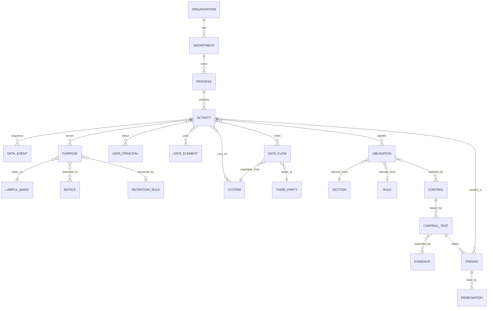

# Graph Modelling Guide - how the vault represents reality

## Core idea
**Objects are notes; relationships are links in properties.** Nothing is nested. Obsidian's graph view, backlinks and Dataview queries let you traverse in any direction:
- "Which activities use this system?"
- "Which vendors receive health data?"
- "Which obligations apply to this flow?"
- "Which findings affect children?"

![[mermaid-diagram.png]]
## ID conventions
| Object | Pattern | Example |
|---|---|---|
| Organisation | ORG-<code> | ORG-ACME |
| Department | DEP-<org>-<code> | DEP-ACME-HR |
| Process | PRC-<org>-<nn> (or catalogue id) | PRC-ACME-012 |
| Activity | ACT-<org>-<dept>-<nnn> | ACT-ACME-HR-004 |
| Data Event | EVT-<activity>-<nn> | EVT-ACT-ACME-HR-004-03 |
| Purpose | PUR-<org>-<nnn> | PUR-ACME-021 |
| System | SYS-<org>-<code> | SYS-ACME-SAPHR |
| Third Party | TP-<org>-<code> | TP-ACME-AWS |
| Data Flow | FLW-<org>-<nnn> | FLW-ACME-044 |
| Notice | NTC-<org>-<code>-v<n> | NTC-ACME-WEB-v3 |
| Retention Rule | RET-<org>-<nnn> | RET-ACME-007 |
| Obligation | OBL-<area>-<nn> (framework) | OBL-SEC-02 |
| Control | CTL-<area>-<nn> (framework) | CTL-SEC-02 |
| Control Test | TST-<cycle>-<control>-<nn> | TST-2026Q4-CTL-SEC-02-01 |
| Evidence | EVD-<org>-<nnnn> | EVD-ACME-0142 |
| Finding | FND-<org>-<nnn> | FND-ACME-031 |
| Remediation | REM-<org>-<nnn> | REM-ACME-031 |

## Rules
1. **Create once, link many.** Systems, third parties, purposes, notices and retention rules are shared objects.
2. **Flags live on the Activity.** The engine reads `lawful_basis` and `flags`. The entity-level role comes from the Entity Profile.
3. **Context tags drive risk, not applicability.** Tags like `health` and `biometric` raise the impact score.
4. **Confidence is explicit.** Every flow and activity has `confidence: low|medium|high` (how sure the mapping is).
5. **Catalogue -> instance.** The process catalogue (`05 Processes/Catalogue`) holds templates. Copy the relevant ones into the client's `Processes` folder and edit them to match reality.
6. **N/A needs a reason.** Record it in the engine output or an override: `overrides: {OBL-XX: "reason"}`.
