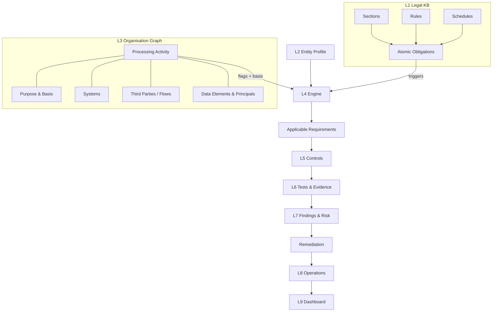

# README - Start Here

## 1. Set up (10 minutes)
1. Open this folder as a vault in Obsidian.
2. Install community plugins: **Dataview** (required; enable "JavaScript queries" for the countdown). Optional: **Templater**, **Excalidraw/Canvas** for flow diagrams, **Obsidian Git** for team versioning.
3. Settings > Core plugins > **Templates**: set the template folder to `90 Templates`.
4. Install Python 3 + `pip install pyyaml` to run the engine.

## 2. The framework in one picture

## 3. How to run a client assessment
1. **Copy** `20 Example - DemoPay` as a pattern, or create `20 Client/<ORG>/`.
2. **Profile the entity** using [[Entity Scoping Questionnaire]]. Create the Entity Profile from `TPL - Entity Profile`.
3. **Pick templates** from the [[Sector Index]] and [[Process Catalogue Index]] (common functions + the client's sector).
4. **Run workshops** with the [[Discovery Question Bank]]. For each real activity create a note from `TPL - Processing Activity`. Link systems, third parties, flows, purposes, notices and retention rules. Create shared objects once and link them many times.
5. **Set** `lawful_basis` and `flags` on every activity. Set `entity_profile` to link the profile.
6. **Run the engine** from the vault root: `python3 engine/dpdp_engine.py`. Each activity gets `11 Assessments/Engine Output/Applicability - <ACT>.md` plus a CSV matrix.
7. **Test controls.** From each applicable obligation, follow its linked controls and create `Control Test` notes with evidence. Rate 0-4.
8. **Raise findings** (one per activity/control gap) and score them with [[Risk Methodology]]. Link a remediation.
9. **Report** with [[Home]]. Export tables or use the Excel master register for client-facing packs.

## 4. Conventions
- **IDs** are in [[Graph Modelling Guide]]. Note file names start with the ID so links stay stable.
- **Properties** are the source of truth for queries. The body is for narrative.
- **Obligations and controls are framework-owned.** Don't edit them per client. Add client-specific controls as `CTL-<ORG>-xx`.
- **Dates:** Phase 2 = 13 Nov 2026, Phase 3 = 13 May 2027 (computed; see [[Commencement & Phases]]).
- **Confidence `verify`** in sector retention anchors means check the current legal text before citing it.

## 5. Keeping it current
- Log each notification in [[Notifications Log]] and re-run impact on obligations and controls.
- When a law changes an obligation, edit the obligation note once. Every activity picks up the change on the next engine run.

## 6. Disclaimer
This is a working compliance framework, not legal advice. Obligation wording is summarised from the Gazette text (verified Sept 2026 against dpdprules.org and the official PDFs). Confirm against the official text for client deliverables.
