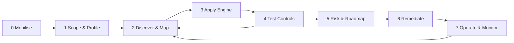

# Engagement Methodology - DPDP Unified Assessment & Tracking Framework (DUATF)

The framework runs as **7 stages**. Stages 2-4 loop: every new discovery (a system, a vendor, a WhatsApp group) goes back into the graph and the engine re-computes what applies.

| Stage | Goal | Key activities | Framework objects produced | Exit criteria |
|---|---|---|---|---|
| **0 Mobilise** | Sponsor, team, access | Kick-off, RACI, PBC list issued, vault cloned | Programme, Assessment Cycle, Roles | Sponsor sign-off; SPOCs per department named |
| **1 Scope & Profile** | Know what law applies to *this* entity | Entity scoping questionnaire, role decision tree, sector overlay selection, exemption screen | Entity Profile, Exemption register, Sector overlay links | Profile approved by Legal |
| **2 Discover & Map** | Reconstruct reality as a graph | Department workshops (question bank), system inventory, vendor reconciliation, shadow-data scan, walk-throughs | Processes, Activities, Data Events, Purposes, Systems, Third Parties, Data Flows | >= 90% of in-scope departments mapped; every activity has purpose + basis + system |
| **3 Apply engine** | Derive applicable obligations | Set activity flags; run `engine/dpdp_engine.py`; review N/A decisions | Applicable Requirement lists per activity | Legal reviews engine output & overrides |
| **4 Test controls** | Evidence-based rating | Map obligations -> controls; test (inquiry + one stronger test); rate 0-4 | Control Tests, Evidence, Findings | All P1/P2/P3 (Rs 200-250 cr) obligations tested |
| **5 Risk & roadmap** | Prioritise | Score findings (L x I), group into remediation workstreams, align to Nov-2026 / May-2027 dates | Risks, Remediation plan | Management accepts roadmap |
| **6 Remediate** | Close gaps | Workstreams: notice & consent, rights, retention, vendor DPAs, security, breach | Remediation actions, retest evidence | Findings closed after retest |
| **7 Operate** | BAU compliance | Rights log, breach register, consent ledger, vendor reviews, DPIA calendar, regulatory change log | Operations trackers | KPIs reported quarterly |

## Indicative effort (first cycle)

| Organisation size | Departments | Typical activities | Stage 1-5 duration | Team |
|---|---|---|---|---|
| Small (< 200 staff, 1 product) | 5-8 | 30-60 | 4-6 weeks | 2 |
| Mid (200-2,000 staff, few products) | 8-15 | 80-200 | 8-12 weeks | 3-4 |
| Large / regulated (> 2,000, multi-entity) | 15-40 | 250-800 | 14-24 weeks (per entity waves) | 5-10 |

## Assessment rules of thumb
1. **Inquiry alone never rates above 1.** A rating of 3+ requires inspection, observation, re-performance or data analytics.
2. **Test the front line.** Watch a receptionist, branch officer or field agent collect data. Paper and verbal channels are where notice fails.
3. **Re-perform the rights.** Submit a real access, erasure and withdrawal request through a public channel and time it.
4. **Follow the data out.** For every activity, ask "who else sees this?" until you reach the last recipient. Vendors of vendors count.
5. **One finding, one owner, one activity.** Never "Section 8 non-compliant".
6. **Record N/A with a reason.** Every not-applicable decision must link to the flag or exemption that caused it.
